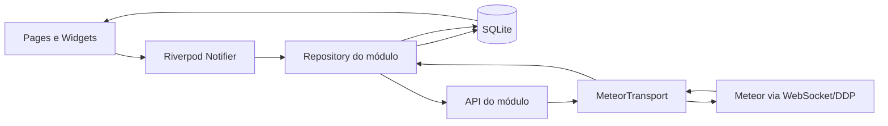
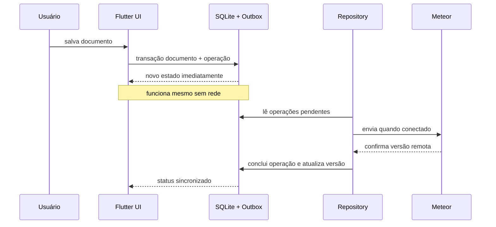

# Synergia Flutter-Meteor Boilerplate

Boilerplate oficial para desenvolvimento de aplicativos Flutter integrados ao
[Synergia MeteorReactBaseMUI](https://github.com/synergia-labs/MeteorReactBaseMUI).

O projeto fornece uma base mobile modular, reativa e offline-first. A
arquitetura preserva os principais modelos mentais usados no frontend React do
boilerplate Synergia: módulos de negócio, APIs por módulo, sessão global,
`UserProfile`, roles, recursos de autorização, publicações reativas e contratos
padronizados com o Meteor.

O módulo `example` é a implementação de referência. Ele demonstra CRUD,
autenticação, autorização, SQLite, outbox, sincronização bidirecional,
resolução de conflitos e mídias associadas aos documentos.

## Sumário

- [Objetivos](#objetivos)
- [Tecnologias](#tecnologias)
- [Princípios arquiteturais](#princípios-arquiteturais)
- [Analogia entre React e Flutter](#analogia-entre-react-e-flutter)
- [Visão geral da arquitetura](#visão-geral-da-arquitetura)
- [Estrutura de pastas](#estrutura-de-pastas)
- [Inicialização do aplicativo](#inicialização-do-aplicativo)
- [Estado global com Riverpod](#estado-global-com-riverpod)
- [Autenticação, sessão e UserProfile](#autenticação-sessão-e-userprofile)
- [Roles, recursos e autorização](#roles-recursos-e-autorização)
- [Integração com Meteor por DDP](#integração-com-meteor-por-ddp)
- [Arquitetura dos módulos](#arquitetura-dos-módulos)
- [Offline-first](#offline-first)
- [Imagens, áudios e anexos](#imagens-áudios-e-anexos)
- [Conflitos de edição](#conflitos-de-edição)
- [Rotas e navegação](#rotas-e-navegação)
- [Tema e componentes compartilhados](#tema-e-componentes-compartilhados)
- [Configuração e execução](#configuração-e-execução)
- [Contrato esperado do backend](#contrato-esperado-do-backend)
- [Como criar um novo módulo](#como-criar-um-novo-módulo)
- [Testes](#testes)
- [Produção e segurança](#produção-e-segurança)
- [Solução de problemas](#solução-de-problemas)
- [Glossário](#glossário)

## Objetivos

Este boilerplate foi criado para:

- reduzir o tempo necessário para iniciar um aplicativo Flutter conectado ao
  ecossistema Synergia;
- manter uma arquitetura única e previsível para todos os módulos;
- aproximar a experiência de desenvolvimento mobile da experiência já
  conhecida no frontend React;
- permitir que o aplicativo continue útil sem conexão;
- evitar perda silenciosa de dados durante sincronizações concorrentes;
- centralizar autenticação, perfil, roles, recursos e conectividade;
- oferecer uma referência de produção que também seja compreensível para
  pessoas desenvolvedoras plenas e juniores.

O boilerplate não permite cadastro de usuários pelo aplicativo. Criação de
conta, verificação de email, vínculo com empresa, alteração de roles e gestão
de acesso pertencem ao sistema Web e ao backend Meteor.

## Tecnologias

Principais tecnologias utilizadas:

| Tecnologia | Responsabilidade |
| --- | --- |
| Flutter e Material 3 | Interface multiplataforma |
| Riverpod | Injeção de dependências e estado reativo global/local |
| GoRouter | Rotas, redirecionamentos e proteção de acesso |
| `dart_meteor` | DDP, métodos Meteor, publicações e login |
| SQLite / `sqflite` | Fonte de verdade local e fila offline |
| `flutter_secure_storage` | Token da sessão e cache mínimo do perfil |
| `http` | Download de arquivos por streaming |
| `image_picker` | Câmera e galeria |
| `record` | Gravação de voz |
| `file_picker` | Seleção de arquivos e áudios |
| `audioplayers` | Reprodução de áudio local |
| `open_filex` | Abertura de anexos com aplicativos do dispositivo |
| `share_plus` | Compartilhamento pelo painel nativo |

## Princípios arquiteturais

### Uma única arquitetura

Todo código novo deve seguir a estrutura `app + modules + services + shared`.
Não existem árvores paralelas de `pages`, `models`, controllers ou repositories
fora dessa organização.

### Organização por domínio

Regras e telas de uma funcionalidade ficam juntas em `lib/modules/<modulo>`.
Isso torna a fronteira do módulo explícita e evita uma pasta global de models
ou páginas crescendo indefinidamente.

### Dependências apontam para dentro

Dentro de um módulo, a direção esperada é:

```text
presentation  ─────►  data  ─────►  services
      │                │
      └────────────► domain
```

- `domain` não depende de Flutter, banco ou Meteor;
- `data` conhece domínio, persistência e contratos externos;
- `presentation` conhece domínio, repositories e Riverpod;
- `services` oferece infraestrutura compartilhada, sem conhecer telas de
  módulos.

### Estado local como fonte da interface

Em módulos offline-first, a UI não lê diretamente a coleção temporária do DDP.
Ela observa o banco local. A rede atualiza o banco, e o banco atualiza a UI.

### Servidor como autoridade de segurança

Roles e recursos no mobile controlam navegação e visibilidade. Toda operação
continua sendo validada no backend. Esconder um botão nunca substitui a
autorização do método Meteor.

## Analogia entre React e Flutter

O objetivo não é copiar APIs do React literalmente, mas manter o mesmo modelo
mental.

| Meteor/React | Flutter/Riverpod |
| --- | --- |
| `AuthProvider` / `AuthContext` | `AuthController` e providers globais |
| `AuthContext.user` | `currentUserProfileProvider` |
| `userprofileApi` | `UserProfileApi` |
| `useTracker` | `ref.watch`, `StreamProvider` e streams dos repositories |
| `Meteor.status()` | `meteorConnectionStatusProvider` / `meteorConnectedProvider` |
| Minimongo reativo | SQLite observado pelo repository |
| `ProductBase` / APIs de módulo | `ProductMobileApiBase` |
| `mapRolesRecursos` | `AccessControlPolicy.resourcesByRole` |
| `RenderWithPermission` | `canAccessResourceProvider` |
| recursos declarados nas rotas | redirect do `GoRouter` + resource constants |
| React state de tela | estado de `Notifier` ou estado local do Widget |
| Provider de módulo | providers localizados dentro do módulo |

Exemplo de consumo do usuário global:

```dart
final profile = ref.watch(currentUserProfileProvider);

Text(profile?.displayName ?? 'Usuário');
```

Exemplo de autorização declarativa:

```dart
final canCreate = ref.watch(
  canAccessResourceProvider(ExampleResources.create),
);

if (canCreate) {
  // Exibe a ação de criação.
}
```

Assim como um Context ou hook React, alterações no perfil ou nas permissões
reconstroem somente os consumidores interessados.

## Visão geral da arquitetura



Fluxo de uma alteração offline:



## Estrutura de pastas

```text
lib/
├── main.dart
├── app/
│   ├── app.dart
│   ├── auth/
│   │   ├── auth_controller.dart
│   │   └── auth_providers.dart
│   ├── pages/
│   │   ├── login_page.dart
│   │   └── no_permission_page.dart
│   ├── router/
│   │   └── app_router.dart
│   └── theme/
│       └── app_theme.dart
├── modules/
│   ├── example/
│   │   ├── domain/
│   │   │   ├── example.dart
│   │   │   ├── example_asset.dart
│   │   │   └── example_resources.dart
│   │   ├── data/
│   │   │   ├── example_api.dart
│   │   │   ├── example_local_store.dart
│   │   │   └── example_repository.dart
│   │   └── presentation/
│   │       ├── example_controller.dart
│   │       ├── example_list_page.dart
│   │       └── example_detail_page.dart
│   └── user_profile/
│       ├── domain/
│       │   ├── user_profile.dart
│       │   └── user_profile_resources.dart
│       ├── data/
│       │   ├── user_profile_api.dart
│       │   └── user_profile_repository.dart
│       └── presentation/
│           └── user_profile_providers.dart
├── services/
│   ├── auth/
│   │   ├── access_control_policy.dart
│   │   ├── meteor_auth_service.dart
│   │   └── session_storage_service.dart
│   ├── config/
│   │   └── app_config.dart
│   └── meteor/
│       ├── meteor_api_base.dart
│       ├── meteor_client_provider.dart
│       ├── meteor_error_mapper.dart
│       ├── meteor_subscription.dart
│       ├── meteor_transport.dart
│       └── product_mobile_api_base.dart
├── shared/
│   └── widgets/
│       └── app_scaffold.dart
└── images/
    └── synergia.png

test/
├── modules/
│   ├── example/
│   └── user_profile/
└── services/

docs/
tool/
```

Responsabilidade das pastas de primeiro nível:

| Pasta | Conteúdo permitido |
| --- | --- |
| `app` | bootstrap, sessão global, rotas, páginas sistêmicas e tema |
| `modules` | funcionalidades de negócio organizadas por domínio |
| `services` | integração e infraestrutura compartilhada |
| `shared` | widgets e utilitários realmente reutilizáveis |
| `test` | testes espelhando a organização de `lib` |
| `tool` | verificadores e ferramentas de desenvolvimento |
| `docs` | documentação complementar |

## Inicialização do aplicativo

O fluxo começa em `main.dart`:

1. o binding do Flutter é inicializado;
2. `ProviderScope` cria o container raiz do Riverpod;
3. `App` lê configuração e roteador por providers;
4. `AuthController` tenta restaurar a sessão;
5. o roteador mantém a splash enquanto o bootstrap ocorre;
6. usuário autenticado segue para o módulo permitido;
7. usuário sem sessão segue para `/login`.

`MaterialApp.router` aplica os temas claro/escuro e usa o `GoRouter` como fonte
única de navegação.

## Estado global com Riverpod

Riverpod tem três responsabilidades neste projeto.

### Injeção de dependências

Clientes e repositories são construídos por providers:

```text
AppConfig
   └── MeteorClient
          └── MeteorTransport
                 ├── MeteorAuthService
                 ├── UserProfileApi
                 └── ExampleApi
```

Isso permite substituir implementações por fakes em testes sem singletons
globais ou service locators ocultos.

### Contexto global

Os seguintes dados podem ser consumidos em qualquer ponto abaixo do
`ProviderScope`:

- estado da autenticação;
- `UserProfile` atual;
- roles do usuário;
- recursos efetivos;
- verificação de um recurso específico;
- status da conexão Meteor;
- configuração do aplicativo.

Providers globais importantes:

| Provider | Valor |
| --- | --- |
| `authControllerProvider` | bootstrap, login, logout e estado da sessão |
| `currentUserProfileProvider` | perfil funcional atual |
| `currentUserRolesProvider` | conjunto de roles |
| `currentUserResourcesProvider` | conjunto de recursos efetivos |
| `canAccessResourceProvider(resource)` | autorização reativa para um recurso |
| `meteorConnectionStatusProvider` | status DDP completo |
| `meteorConnectedProvider` | booleano simplificado de conexão |
| `appConfigProvider` | nome, URL Meteor e debug |

### Estado de módulo

Cada módulo mantém seu próprio controller. O `ExampleController`, por exemplo,
coordena filtros, ordenação, loading e mensagens de erro da lista. O repository
continua responsável por dados e sincronização.

Regra prática:

- estado visual efêmero de um único widget pode ficar no `State` do widget;
- estado compartilhado por uma tela deve ficar no controller do módulo;
- estado transversal ao aplicativo deve ser um provider global explícito;
- documentos persistentes nunca devem existir apenas em memória.

## Autenticação, sessão e UserProfile

Autenticação e perfil são conceitos relacionados, mas diferentes.

### Sessão Meteor

`MeteorAuthService` cuida de:

- login com email e senha pelo Accounts Password;
- retomada por login token;
- validade e expiração do token;
- logout e revogação da sessão.

O token, ID do usuário e expiração são armazenados com
`flutter_secure_storage`. Credenciais de senha nunca são persistidas.

Se o aplicativo for iniciado sem internet e existir uma sessão local ainda não
expirada, ele pode abrir em modo offline. A sessão será validada novamente pelo
Meteor quando a conexão retornar.

### Módulo UserProfile

`UserProfileApi` assina `userprofile.getLoggedUserProfile` e observa a coleção
`userprofile`. O módulo mantém os campos básicos do boilerplate Meteor:

| Campo Meteor | Campo Dart | Finalidade |
| --- | --- | --- |
| `_id` | `id` | identificador do usuário |
| `photo` | `photo` | foto/avatar |
| `username` | `username` | nome de exibição |
| `email` | `email` | email funcional |
| `phone` | `phone` | telefone |
| `roles` | `roles` | perfis de acesso |
| `status` | `status` | situação do cadastro |
| `createdat` | `createdAt` | auditoria de criação |
| `lastupdate` | `lastUpdate` | versão/auditoria |
| `sincronizadoEm` | `syncedAt` | data de sincronização do `IDoc` |
| `needSync` | `needsSync` | sinalizador de sincronização do `IDoc` |
| `createdby` | `createdBy` | autor da criação |
| `updatedby` | `updatedBy` | autor da alteração |

Essa divisão reproduz a estrutura TypeScript: os campos funcionais pertencem a
`IUserProfile`, enquanto os campos de auditoria e sincronização são herdados de
`IDoc`.

O parser também aceita extensões comuns de produtos derivados — `inativo`,
`nome_minusculo`, `empresaId`, `nomeEmpresa`, `empresa`, `resources` e
`permissions`. Esses campos são opcionais e não são apresentados como parte do
contrato-base do boilerplate.

Uma versão pequena do perfil é mantida em cache seguro. Nome, email, empresa,
roles e recursos continuam disponíveis durante um bootstrap offline. Fotos em
base64 não são duplicadas nesse cache para evitar armazenamento desnecessário.
O cache registra separadamente o ID da sessão Meteor e o `_id` do perfil para
suportar contas associadas. Perfil ausente, assinatura encerrada com erro ou
`status: disabled` invalidam a sessão e removem o cache local.

`UserProfileResources` mantém os contratos `USUARIO_VIEW`, `USUARIO_CREATE`,
`USUARIO_UPDATE` e `USUARIO_REMOVE`. Usuários comuns recebem apenas os recursos
de autoatendimento (`VIEW` e `UPDATE`); administradores recebem os quatro.

## Roles, recursos e autorização

Os nomes de roles são centralizados em `SynergiaRoles`. Cada módulo declara
seus recursos em um arquivo próprio, como `ExampleResources`:

```dart
abstract final class ExampleResources {
  static const view = 'EXAMPLE_VIEW';
  static const create = 'EXAMPLE_CREATE';
  static const update = 'EXAMPLE_UPDATE';
  static const remove = 'EXAMPLE_REMOVE';
}
```

O registro roles → recursos fica em `accessControlPolicyProvider`, equivalente
ao `mapRolesRecursos` do React.

O `RoleType` básico é reproduzido literalmente: `Publico`, `Usuario` e
`Administrador`. Produtos derivados podem acrescentar suas próprias roles ao
mapa, sem alterar o contrato-base deste boilerplate.

Se o `UserProfile` trouxer uma lista `resources`, ela prevalece sobre o mapa
local. Isso permite evoluir para permissões calculadas pelo backend sem mudar o
código consumidor.

A autorização é aplicada em dois níveis no mobile:

- rota: usuário sem `EXAMPLE_VIEW` é direcionado para `/no-permission`;
- ação: criar, editar e excluir dependem dos recursos correspondentes.

O backend deve repetir a validação no método/publicação. A autorização no
cliente é uma melhoria de UX, não uma fronteira de segurança.

## Integração com Meteor por DDP

O aplicativo usa DDP pelo WebSocket nativo do Meteor. Não é criada uma API REST
paralela para CRUD e publicações.

### Conceitos DDP

- **Método:** operação request/response, como `example.insert`.
- **Publicação:** conjunto reativo de documentos autorizado pelo servidor.
- **Subscription:** vínculo do cliente com uma publicação.
- **Coleção DDP:** cache reativo em memória alimentado por mensagens `added`,
  `changed` e `removed`.
- **Ready:** indica que o snapshot inicial da publicação foi entregue.

### Camada de serviços Meteor

#### `MeteorClientProvider`

Cria uma única conexão `MeteorClient` para o container Riverpod. A conexão é
encerrada automaticamente quando o provider é descartado.

#### `MeteorTransport`

É a abstração usada pelos módulos. Ela expõe:

- chamadas de métodos;
- subscriptions;
- observação de coleções;
- usuário Meteor;
- status de conexão;
- reconexão e espera por conectividade.

O restante do aplicativo não depende diretamente de detalhes do pacote
`dart_meteor`, o que facilita testes e futuras substituições.

#### `MeteorApiBase<T>`

Prefixa métodos e publicações com o nome do módulo e converte documentos em
objetos de domínio.

```dart
callMethod('mobilePull'); // example.mobilePull
subscribe('exampleList'); // example.exampleList
```

#### `ProductMobileApiBase<T>`

Adiciona as convenções do `ProductBase` do boilerplate Web:

- lista;
- detalhe;
- contador;
- insert;
- update;
- upsert;
- remove;
- sync.

#### `MeteorSubscription`

Encapsula o handler do pacote, oferece streams de `ready` e erros e garante que
a subscription seja interrompida no descarte.

#### `MeteorErrorMapper`

Traduz erros técnicos em falhas de domínio/UI:

- autenticação;
- autorização;
- validação;
- conexão;
- timeout;
- desconhecido.

## Arquitetura dos módulos

Todo módulo segue até três camadas.

### `domain`

Contém:

- entidades e value objects;
- enums;
- recursos de autorização;
- conversão entre nomes do Meteor e propriedades Dart quando isso faz parte do
  contrato da entidade.

Não deve importar Flutter, SQLite, HTTP ou widgets.

### `data`

Contém:

- API Meteor do módulo;
- local store;
- repository;
- DTOs exclusivamente externos, quando necessários.

A API conhece nomes de métodos/publicações. O local store conhece persistência.
O repository orquestra ambos.

### `presentation`

Contém:

- controllers/notifiers;
- providers específicos do módulo;
- páginas;
- widgets que não são reutilizados por outros módulos.

Widgets só chamam controllers ou repositories em ações bem delimitadas. Eles
não montam payloads DDP nem executam SQL.

## Offline-first

Offline-first significa que a ausência de rede é um estado normal, não uma
exceção de interface.

### Fonte de verdade local

O módulo Example usa `synergia_offline_v1.db`. As tabelas são:

| Tabela | Responsabilidade |
| --- | --- |
| `examples` | snapshot local, versão remota e status de sincronização |
| `example_assets` | metadados de imagens, áudios e anexos |
| `sync_queue` | outbox transacional de mutações |
| `sync_metadata` | cursores incrementais confirmados |

O conteúdo binário não é armazenado no SQLite. O banco mantém caminhos locais,
URLs, MIME, tamanho e checksum.

### Escrita local e outbox

Ao salvar:

1. o documento recebe UUID no mobile;
2. documento e operação `upsert` são gravados na mesma transação;
3. a UI recebe o novo valor imediatamente;
4. o repository tenta sincronizar sem bloquear a navegação.

A restrição única `(entity_type, entity_id, action)` torna a fila idempotente:
várias edições antes do envio produzem uma operação pendente com o snapshot
mais recente.

### Disparadores de sincronização

A sincronização é tentada:

- na inicialização do repository;
- ao reconectar o DDP;
- quando uma publicação sinaliza alteração remota;
- após uma gravação local;
- manualmente pelo gesto de atualizar;
- periodicamente a cada 30 segundos.

Execuções simultâneas são bloqueadas por uma trava simples no repository.

### Push

Documentos são enviados antes de seus arquivos. Isso garante que o vínculo do
asset sempre tenha um documento remoto correspondente.

Falhas usam backoff exponencial entre 2 segundos e 5 minutos. Uma falha de
conexão interrompe a rodada para não consumir tentativas de toda a fila.

### Pull incremental

`mobilePull` recebe o último cursor confirmado e devolve:

- documentos alterados;
- IDs excluídos, por tombstones;
- novo cursor;
- indicador de próxima página.

O cursor só é persistido depois que a página é aplicada localmente. Uma edição
local pendente nunca é sobrescrita por um pull concorrente.

### Exclusões

Uma exclusão offline marca o documento localmente e cria uma operação `delete`.
No sentido servidor → mobile, tombstones removem o documento e seus dados
associados somente quando não existe uma mutação local pendente.

### Estados de sincronização

Documentos:

| Estado | Significado |
| --- | --- |
| `synced` | confirmado pelo servidor |
| `pending` | alteração local na fila |
| `syncing` | envio em andamento |
| `failed` | última tentativa falhou |
| `conflict` | versão remota divergiu da base local |

Assets:

| Estado | Significado |
| --- | --- |
| `localOnly` | existe apenas no aparelho |
| `uploading` | envio em andamento |
| `available` | disponível no servidor e/ou localmente |
| `downloading` | download em andamento |
| `failed` | transferência falhou |

## Imagens, áudios e anexos

Há três categorias explícitas:

| Tipo | Mobile → servidor | Servidor → mobile |
| --- | --- | --- |
| Imagem | upload automático | download automático para uso offline |
| Áudio/gravação | upload automático | download automático para uso offline |
| Anexo genérico | upload automático | somente metadados e link até ação do usuário |

### Upload

- arquivo copiado para o sandbox antes de entrar na fila;
- limite atual de 15 MB por arquivo;
- chunks de 192 KiB;
- UUID como chave idempotente;
- offset confirmado pelo servidor;
- SHA-256 para integridade;
- leitura sem carregar o arquivo inteiro em memória.

### Download

- resposta HTTP processada por streaming;
- gravação inicial em arquivo `.part`;
- validação de limite e checksum;
- rename para o caminho definitivo somente após sucesso.

### Anexos sob demanda

Um anexo apenas remoto fica:

- habilitado online com a mensagem “Disponível para baixar”;
- desabilitado offline com a mensagem para conectar;
- disponível offline depois do primeiro toque e download.

Depois de baixado, um novo toque oferece:

- abrir com um aplicativo compatível do dispositivo;
- compartilhar pelo painel nativo.

O compartilhamento usa uma cópia temporária com o nome original, sem expor o
UUID interno do cache.

## Conflitos de edição

Cada documento mantém a versão do servidor usada como base. O
`mobileUpsert(document, baseVersion)` permite que o backend compare versões.

Se Web e mobile alterarem o mesmo documento:

1. o backend retorna `sync-conflict`;
2. a fila desse documento é pausada;
3. o estado local muda para `conflict`;
4. a interface oferece duas decisões explícitas:
   - usar a versão do servidor;
   - manter e reenviar a versão local sobre a nova base.

Não existe estratégia silenciosa de “última escrita vence”.

## Rotas e navegação

As rotas ficam exclusivamente em `app/router/app_router.dart`.

Rotas atuais:

```text
/splash
/login
/no-permission
/examples
/examples/new
/examples/:id
/examples/:id/edit
```

O redirect observa `AuthState`. Mudanças de login, logout ou `UserProfile`
reavaliam a navegação. Recursos também são conferidos antes de permitir o
acesso ao módulo.

Ao criar um módulo, suas rotas devem ser filhas de uma rota raiz clara e devem
declarar os recursos necessários no mesmo local.

## Tema e componentes compartilhados

`AppTheme` define Material 3, Poppins e tokens Synergia para temas claro e
escuro. Cores e estilos globais não devem ser duplicados dentro dos módulos.

`shared/widgets` recebe somente componentes usados por mais de um módulo.
Widgets exclusivos permanecem em `modules/<modulo>/presentation`.

`AppScaffold` demonstra consumo de contexto global:

- mostra o usuário atual e suas roles;
- observa o status Meteor;
- oferece navegação e logout.

## Configuração e execução

### Pré-requisitos

- Flutter compatível com o SDK Dart definido em `pubspec.yaml`;
- Android Studio/SDK para Android ou Xcode para iOS;
- backend MeteorReactBaseMUI em execução;
- usuário existente, ativo e com email verificado;
- roles com os recursos necessários.

Backend de referência:

```bash
git clone git@github.com:synergia-labs/MeteorReactBaseMUI.git
```

Siga o README do backend para MongoDB, variáveis e execução do Meteor.

### Instalação

```bash
flutter pub get
```

### Variáveis de compilação

As configurações usam `--dart-define`:

| Variável | Padrão | Descrição |
| --- | --- | --- |
| `METEOR_URL` | `http://10.0.2.2:3200` | URL base do Meteor |
| `METEOR_DEBUG` | `false` | logs detalhados do DDP |
| `APP_NAME` | `Synergia Flutter-Meteor Boilerplate` | nome no `MaterialApp` |

`dart-define` não é cofre de segredos. Não coloque senhas, tokens privados ou
chaves administrativas nessas variáveis.

### Android Emulator

`10.0.2.2` representa o host da máquina:

```bash
flutter run \
  --dart-define=METEOR_URL=http://10.0.2.2:3200
```

HTTP sem TLS é aceito apenas pelo manifest de debug. Builds de produção devem
usar HTTPS/WSS.

### iOS Simulator

```bash
flutter run \
  --dart-define=METEOR_URL=http://127.0.0.1:3200
```

### Dispositivo físico

Use um hostname ou IP acessível na mesma rede:

```bash
flutter run \
  --dart-define=METEOR_URL=http://192.168.1.10:3200
```

Confirme firewall, bind do Meteor e acesso do dispositivo à porta.

### Produção

```bash
flutter build appbundle --release \
  --dart-define=METEOR_URL=https://api.exemplo.com \
  --dart-define=APP_NAME='Nome do Produto'
```

O cliente normaliza HTTP/HTTPS para WS/WSS e usa o endpoint `/websocket`.

## Contrato esperado do backend

O mobile espera as convenções do MeteorReactBaseMUI.

### Autenticação e perfil

- Accounts Password habilitado;
- login por email e senha;
- retomada por token;
- publicação `userprofile.getLoggedUserProfile`;
- coleção `userprofile` com os campos descritos anteriormente.

### Example CRUD

| Operação | Contrato DDP |
| --- | --- |
| Lista | `example.exampleList(filter, options)` |
| Contador | `example.countexampleList(filter)` |
| Detalhe | `example.exampleDetail({_id})` |
| Inserir | `example.insert(document)` |
| Atualizar | `example.update(document)` |
| Excluir | `example.remove({_id})` |
| Coleção | `example` |

### Extensões offline-first

| Método | Responsabilidade |
| --- | --- |
| `example.mobilePull` | alterações incrementais e tombstones |
| `example.mobileGet` | snapshot completo para conflito |
| `example.mobileUpsert` | upsert com `baseVersion` |
| `example.mobileAssetsPage` | catálogo paginado de assets |
| `example.uploadAssetChunk` | upload retomável |
| `example.removeAsset` | exclusão de asset |

O backend deve validar autenticação, autorização, schema, MIME, tamanho,
checksum e vínculo do arquivo com o documento.

## Como criar um novo módulo

Considere um módulo `inspection`.

### 1. Crie a estrutura

```text
lib/modules/inspection/
├── domain/
│   ├── inspection.dart
│   └── inspection_resources.dart
├── data/
│   ├── inspection_api.dart
│   ├── inspection_local_store.dart
│   └── inspection_repository.dart
└── presentation/
    ├── inspection_controller.dart
    ├── inspection_list_page.dart
    └── inspection_detail_page.dart
```

### 2. Modele o domínio

- use tipos Dart claros;
- implemente `fromMeteor` e `toMeteorDocument` na fronteira do contrato;
- mantenha os nomes Meteor centralizados nessa conversão;
- não coloque chamadas de API na entidade.

### 3. Declare recursos

```dart
abstract final class InspectionResources {
  static const view = 'INSPECTION_VIEW';
  static const create = 'INSPECTION_CREATE';
  static const update = 'INSPECTION_UPDATE';
  static const remove = 'INSPECTION_REMOVE';
}
```

Registre esses recursos no mapa de `accessControlPolicyProvider` de acordo com
as mesmas roles do frontend React.

### 4. Crie a API

```dart
class InspectionApi extends ProductMobileApiBase<Inspection> {
  const InspectionApi({required super.transport})
    : super(apiName: 'inspection', decode: Inspection.fromMeteor);
}
```

Métodos específicos devem ficar nessa classe, nunca espalhados pelas páginas.

### 5. Implemente o store local

Se o módulo for offline-first:

- crie tabelas e índices explícitos;
- grave documento e outbox na mesma transação;
- exponha streams de leitura;
- armazene cursores somente depois de aplicar o pull;
- escreva testes com `sqflite_common_ffi` em memória.

### 6. Implemente o repository

O repository deve:

- ser a única API de dados consumida pela apresentação;
- coordenar local store e API Meteor;
- tratar push, pull, retry e conflitos;
- não depender de `BuildContext`;
- liberar subscriptions, streams, timers e clientes no descarte.

### 7. Crie controller e páginas

- controller representa estado e ações da funcionalidade;
- página observa providers com `ref.watch`;
- eventos usam `ref.read(...notifier)`;
- permissões são derivadas de `canAccessResourceProvider`;
- loading e falhas devem ser estados explícitos.

### 8. Registre as rotas

Inclua as rotas no `appRouterProvider` e aplique o recurso de visualização no
redirect. Ações internas usam recursos create/update/remove.

### 9. Implemente o mesmo contrato no MeteorReactBaseMUI

Mantenha o mesmo nome de módulo, coleção, publicações, métodos e recursos nos
dois clientes. O objetivo é permitir que uma pessoa desenvolvedora reconheça a
estrutura independentemente de estar no React ou no Flutter.

### 10. Teste online e offline

Cubra pelo menos:

- serialização do contrato Meteor;
- criação offline;
- idempotência da outbox;
- pull incremental;
- tombstone;
- conflito;
- roles e recursos;
- comportamento de arquivos, quando aplicável.

## Testes

### Análise estática

```bash
flutter analyze
```

### Testes automatizados

```bash
flutter test
```

Os testes atuais cobrem:

- tradução de erros Meteor;
- contrato CRUD do Example;
- conversão de campos Meteor;
- persistência offline;
- idempotência da fila;
- proteção de edição local pendente;
- seleção de mídia para download automático;
- pausa e resolução de conflito;
- contrato do `UserProfile`;
- conversão de roles em recursos;
- precedência de recursos publicados pelo servidor.

### Verificação conectada

Com o backend em execução:

```bash
SYNERGIA_TEST_EMAIL='usuario@exemplo.com' \
SYNERGIA_TEST_PASSWORD='senha' \
SYNERGIA_METEOR_URL='http://127.0.0.1:3200' \
dart run tool/verify_meteor_integration.dart
```

O verificador cria dados temporários e valida:

- login e `UserProfile`;
- publicações de lista, contador e detalhe;
- CRUD reativo;
- upload em múltiplos chunks e idempotência;
- imagem, áudio e anexo;
- downloads e checksums;
- conflito otimista;
- tombstone;
- retomada da sessão e logout.

Use somente contas e ambientes destinados a teste.

## Produção e segurança

Checklist mínimo:

- usar HTTPS/WSS;
- configurar proxy para upgrade de WebSocket em `/websocket`;
- validar recursos em todos os métodos e publicações;
- aplicar rate limit ao login e operações sensíveis;
- manter tokens apenas no secure storage;
- nunca registrar senha, token ou chunks base64;
- usar volume persistente e backup para uploads;
- validar nome, MIME, tamanho e checksum no servidor;
- expirar e limpar uploads parciais abandonados;
- definir `applicationId`/Bundle ID próprios para o produto derivado;
- configurar assinatura de release fora do repositório;
- revisar permissões Android/iOS;
- testar migrações SQLite com dados existentes;
- monitorar falhas de sincronização e conflitos.

Importante: `dart-define` fica incorporado no artefato e não deve transportar
segredos.

## Solução de problemas

### Emulador Android não conecta em `localhost`

Use `10.0.2.2`. Dentro do emulador, `localhost` aponta para o próprio Android.

### Dispositivo físico não conecta

Use o IP da máquina na rede, confirme firewall e verifique se o Meteor aceita
conexões externas.

### Login funciona na Web, mas não no mobile

Confira:

- email digitado;
- email verificado;
- usuário ativo;
- URL e WebSocket;
- publicação `getLoggedUserProfile`;
- existência do documento `userprofile` com o mesmo email;
- roles atribuídas.

### Usuário entra, mas vê “Acesso não autorizado”

Verifique se o `UserProfile` publicado possui roles e se o mapa local registra
os recursos do módulo para essas roles. Se o backend publica `resources`, essa
lista é a fonte preferencial no mobile.

### Dados não sincronizam

Verifique o indicador de conexão, estado do documento, última falha da outbox e
contratos `mobilePull`/`mobileUpsert`. Um conflito precisa de decisão explícita
na interface.

### Anexo não abre no primeiro toque

Esse é o comportamento esperado para anexos apenas remotos. O primeiro toque
baixa. O segundo oferece abertura ou compartilhamento.

### Imagem ou áudio remoto não fica offline

Confira URL, autenticação HTTP, MIME, limite de tamanho, checksum e permissão de
escrita no sandbox.

## Glossário

| Termo | Definição |
| --- | --- |
| DDP | protocolo reativo usado pelo Meteor sobre WebSocket |
| Publication | consulta reativa autorizada pelo servidor |
| Subscription | vínculo do cliente com uma publication |
| Provider | unidade de dependência ou estado reativo do Riverpod |
| Notifier | objeto que concentra estado mutável e ações |
| Repository | orquestrador entre fontes locais e remotas |
| Local store | camada de persistência local |
| Offline-first | abordagem em que a operação local não depende da rede |
| Outbox | fila transacional de mutações a enviar |
| Push | envio de alterações locais |
| Pull | recepção de alterações remotas |
| Cursor | posição confirmada no fluxo incremental |
| Tombstone | registro de uma exclusão remota |
| Idempotência | repetir uma operação sem duplicar seu efeito |
| Backoff | aumento progressivo do intervalo entre tentativas |
| Conflito otimista | divergência entre versão base e versão remota |
| Role | perfil agregado atribuído ao usuário |
| Recurso | permissão granular usada por rota ou ação |

## Documentação complementar

- [Integração com o backend Meteor](docs/meteor_backend_integration.md)
- [Sincronização offline-first](docs/offline_first_sync.md)

Ao evoluir o boilerplate, atualize esta documentação junto com o contrato e os
testes. A arquitetura deve continuar reconhecível para quem alterna entre os
frontends React e Flutter.
