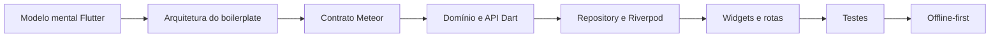
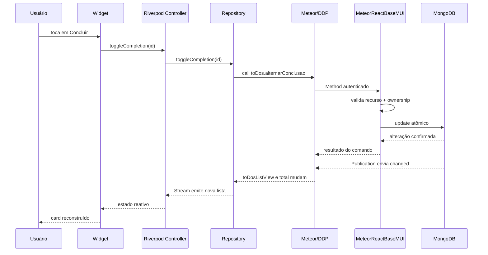
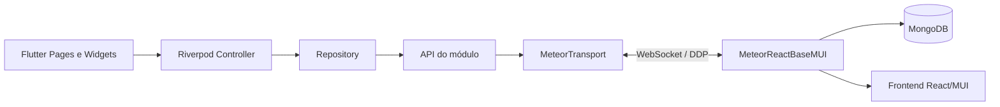
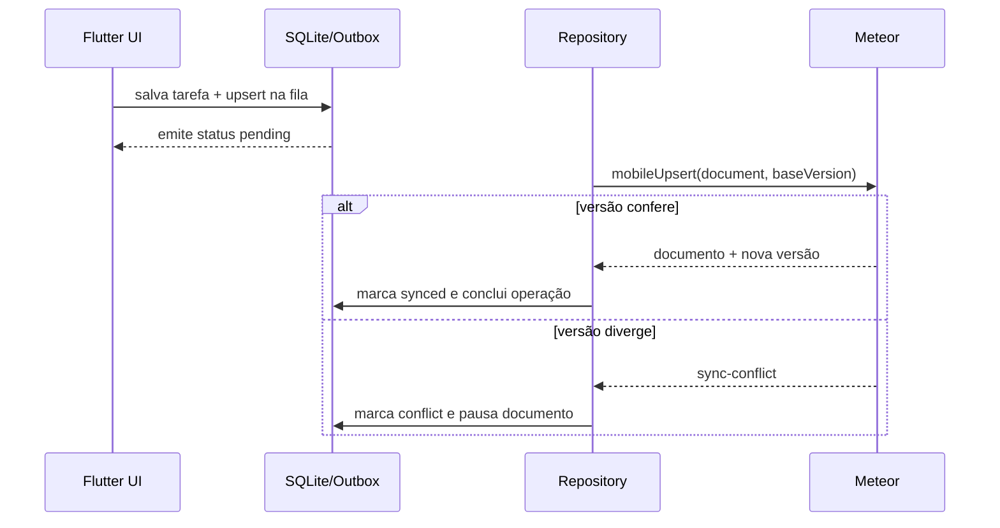

# Tutorial Autoinstrucional: ToDo List Avançado no Boilerplate Flutter + Riverpod + Meteor

> Público-alvo: pessoas desenvolvedoras que conhecem React ou React Native, mas ainda estão formando o modelo mental de
> Flutter, Dart, Riverpod e da arquitetura deste boilerplate.
>
> Objetivo: construir um módulo mobile `toDos` completo, reativo, autorizado e preparado para evoluir para
> offline-first, entendendo o papel de cada camada do Flutter e as mudanças necessárias no servidor Web.
>
> Servidor Web de referência: [`synergia-labs/MeteorReactBaseMUI`](https://github.com/synergia-labs/MeteorReactBaseMUI),
> clonado por `git clone git@github.com:synergia-labs/MeteorReactBaseMUI.git`.
>
> Projeto didático: uma lista de tarefas com busca, paginação, prioridades, prazo, tarefas pessoais, conclusão por
> comando de domínio e controle de acesso por recurso e por documento.

Este material é um guia incremental, não um arquivo único para copiar e colar. Os capítulos de domínio, API,
repository e controller apresentam implementações completas dessas peças; os capítulos de UI apresentam blocos de
construção que devem ser reunidos nas Pages. Os checkpoints e gates finais fazem parte do percurso: um trecho Markdown
não é considerado válido até existir como Dart/TypeScript analisado no projeto.

---

## Sumário

1. [Como estudar com este tutorial](#1-como-estudar-com-este-tutorial)
2. [O que você vai construir](#2-o-que-você-vai-construir)
3. [O modelo mental do Flutter para quem vem de React](#3-o-modelo-mental-do-flutter-para-quem-vem-de-react)
4. [Arquitetura real da solução](#4-arquitetura-real-da-solução)
5. [Flutter para quem vem de React Native](#5-flutter-para-quem-vem-de-react-native)
6. [O que é Flutter e o que é convenção do boilerplate](#6-o-que-é-flutter-e-o-que-é-convenção-do-boilerplate)
7. [Mapa do repositório e fontes de verdade](#7-mapa-do-repositório-e-fontes-de-verdade)
8. [Modelando o domínio da ToDo List](#8-modelando-o-domínio-da-todo-list)
9. [Preparando o ambiente completo](#9-preparando-o-ambiente-completo)
10. [Implementando o contrato no servidor MeteorReactBaseMUI](#10-implementando-o-contrato-no-servidor-meteorreactbasemui)
11. [Criando a estrutura do módulo Flutter](#11-criando-a-estrutura-do-módulo-flutter)
12. [Entidade, enums e recursos](#12-entidade-enums-e-recursos)
13. [Integração DDP com `ToDosApi`](#13-integração-ddp-com-todosapi)
14. [Repository: a fronteira de dados](#14-repository-a-fronteira-de-dados)
15. [Estado reativo com Riverpod](#15-estado-reativo-com-riverpod)
16. [Rotas, sessão e autorização](#16-rotas-sessão-e-autorização)
17. [Construindo a tela de lista](#17-construindo-a-tela-de-lista)
18. [Construindo detalhe, criação e edição](#18-construindo-detalhe-criação-e-edição)
19. [Evoluindo o módulo para offline-first](#19-evoluindo-o-módulo-para-offline-first)
20. [Validação e testes](#20-validação-e-testes)
21. [Erros frequentes](#21-erros-frequentes)
22. [Checklist final para PR](#22-checklist-final-para-pr)
23. [Próximos passos](#23-próximos-passos)
24. [Glossário](#24-glossário)

---

## 1. Como estudar com este tutorial

Este material não é uma tradução mecânica de React para Flutter. A proposta é preservar os modelos mentais úteis que
você já possui e substituir os que não se aplicam ao Flutter.

Em cada capítulo, percorra quatro níveis:

| Nível | Pergunta | Resultado esperado |
| --- | --- | --- |
| Conceito | Por que essa peça existe? | Você consegue explicar sem citar um arquivo. |
| Arquitetura | Em qual camada ela mora? | Você não mistura UI, domínio e transporte. |
| Implementação | Como o boilerplate expressa a ideia? | O código segue os padrões existentes. |
| Checkpoint | Como provar que funciona? | Você valida antes de acumular erros. |

### 1.1 Etiquetas mentais

Ao longo do tutorial, classifique cada decisão em uma destas etiquetas:

1. **Conceito Flutter/Dart**: mecanismo da plataforma, como `Widget`, `Future`, `Stream`, `BuildContext` ou ciclo de
   vida.
2. **Padrão do boilerplate**: convenção local, como `domain/data/presentation`, `ProductMobileApiBase`, Riverpod,
   `AppScaffold` ou recursos de acesso.
3. **Passo servidor obrigatório**: contrato ou proteção que precisa existir no `MeteorReactBaseMUI`.
4. **Expansão offline-first**: infraestrutura adicional para operar sem rede, sincronizar e tratar conflitos.

### 1.2 O erro do desenvolvedor apressado

Copiar `lib/modules/example`, trocar `Example` por `ToDo` e apagar o que não parece necessário pode produzir uma tela,
mas não produz domínio compreendido. Ao final, você deve saber responder:

- por que `Widget` não é equivalente a um elemento DOM;
- por que `build()` pode executar muitas vezes e não deve disparar uma chamada remota;
- por que `ref.watch` e `ref.read` têm papéis diferentes;
- por que uma Publication não é um endpoint REST que devolve uma lista;
- por que o Flutter não deve importar nem reproduzir regras internas do servidor;
- por que esconder “Excluir” não protege um documento;
- por que um repository não recebe `BuildContext`;
- por que offline-first exige mudanças no servidor, e não apenas SQLite no aparelho.

> **Regra de ouro**
>
> O Widget descreve a interface para um estado. O controller transforma intenções do usuário em ações. O repository
> coordena dados. O servidor continua sendo a autoridade sobre identidade, autorização e regras de negócio.

### 1.3 Mapa de aprendizagem



Não avance para offline-first antes de conseguir executar e explicar o fluxo conectado. Sincronização não conserta um
contrato remoto mal definido; ela amplifica suas inconsistências.

---

## 2. O que você vai construir

O resultado do percurso principal será um módulo Flutter `toDos` integrado ao mesmo backend usado pela aplicação
React.

### 2.1 Funcionalidades

- login com a conta criada e administrada pela aplicação Web;
- lista reativa de tarefas visíveis ao usuário;
- busca textual com debounce;
- filtro por tarefas abertas ou concluídas;
- paginação de quatro registros controlada pelo servidor;
- criação, visualização, edição e exclusão;
- prioridades `baixa`, `media` e `alta`;
- prazo opcional;
- tarefa pública para usuários autenticados ou pessoal para o próprio autor;
- conclusão e reabertura por comando de domínio;
- autorização visual por recursos;
- autorização real por recursos e ownership no servidor;
- estados explícitos de carregamento, vazio, erro e ausência de conexão;
- testes unitários e verificação integrada com o Meteor.

### 2.2 Fronteiras da solução

| Peça | Responsabilidade |
| --- | --- |
| `ToDo` | representar o domínio e traduzir o contrato Meteor |
| `ToDosApi` | conhecer nomes de Methods, Publications e coleção DDP |
| `ToDosRepository` | oferecer operações de dados para a apresentação |
| `ToDosController` | manter estado da lista e coordenar eventos |
| Pages/Widgets | renderizar, coletar entrada e emitir intenções |
| `GoRouter` | mapear URLs e proteger a entrada do módulo |
| `AccessControlPolicy` | decidir navegação e ações visíveis no mobile |
| `ToDosServerApi` | validar, autorizar, consultar e persistir no MongoDB |

### 2.3 Contrato funcional da tarefa

| Campo | Tipo Dart | Regra |
| --- | --- | --- |
| `id` | `String` | `_id` do Mongo/Meteor |
| `description` | `String` | entre 3 e 200 caracteres |
| `priority` | `ToDoPriority` | baixa, média ou alta |
| `deadline` | `DateTime?` | opcional |
| `personal` | `bool` | se verdadeira, somente o autor lê |
| `completed` | `bool` | controlado pelo comando do servidor |
| `completedAt` | `DateTime?` | preenchido/limpo atomicamente |
| `authorName` | `String?` | fotografia do nome definida no servidor |
| `createdBy` | `String?` | autor de auditoria e ownership |
| `lastUpdate` | `DateTime?` | versão remota e ordenação |

### 2.4 Fluxo final conectado



Observe que não é necessário “recarregar a página” depois de concluir. A mutação volta pelo fluxo reativo da
Publication. Ainda assim, o resultado do Method é útil para feedback imediato e mensagens de negócio.

---

## 3. O modelo mental do Flutter para quem vem de React

### 3.1 Widget é descrição, não instância visual mutável

Em React, um componente retorna elementos React. Em Flutter, `build()` retorna uma árvore imutável de Widgets. O
framework compara essa descrição com a árvore anterior e preserva ou atualiza os objetos internos responsáveis por
layout, pintura e estado.

```dart
class Greeting extends StatelessWidget {
  const Greeting({required this.name, super.key});

  final String name;

  @override
  Widget build(BuildContext context) {
    return Text('Olá, $name');
  }
}
```

A analogia com uma function component é útil, desde que você preserve três diferenças:

- a composição ocorre com construtores Dart, não JSX;
- layout não usa CSS nem DOM;
- o método `build()` deve ser rápido, determinístico e livre de efeitos colaterais.

### 3.2 `build()` não é `useEffect()`

Este código está errado:

```dart
@override
Widget build(BuildContext context) {
  repository.load(); // errado: pode executar em toda reconstrução
  return const CircularProgressIndicator();
}
```

Uma reconstrução pode ocorrer por tema, tamanho, estado observado, ancestral ou navegação. Efeitos pertencem ao ciclo de
vida de um `State`, a um controller Riverpod ou a callbacks de interação.

Neste boilerplate, carregamento e subscriptions de módulo normalmente começam no controller/repository. A Page observa
o resultado.

### 3.3 Estado: três distâncias diferentes

| Distância | Exemplo | Onde fica |
| --- | --- | --- |
| Widget | senha visível, aba selecionada | `State` de `StatefulWidget` |
| Tela/módulo | busca, página, loading, falha | `Notifier` Riverpod |
| Aplicação | sessão, perfil, conexão, recursos | providers globais |

Não transforme todo `useState` antigo em provider. Estado efêmero e privado continua sendo local. Também não mantenha
documentos persistentes apenas no estado do Widget.

### 3.4 `ref.watch`, `ref.read` e `ref.listen`

```dart
final state = ref.watch(toDosControllerProvider);

onPressed: () {
  ref.read(toDosControllerProvider.notifier).refresh();
}

ref.listen(
  toDosControllerProvider.select((value) => value.failure),
  (_, failure) {
    // apresenta um efeito transitório, como SnackBar
  },
);
```

- `watch` declara que a UI depende de um valor e deve reconstruir quando ele mudar;
- `read` obtém uma dependência sem criar observação, ideal dentro de eventos;
- `listen` reage com efeito colateral a uma mudança, sem usar o valor para montar a árvore.

Em linguagem React: `watch` lembra uma assinatura reativa durante a renderização; `read` lembra consultar uma store em
um handler; `listen` ocupa parte do espaço conceitual de um efeito orientado à mudança.

### 3.5 `BuildContext` não é estado global

`BuildContext` indica a posição de um Widget na árvore. Ele serve para localizar tema, navegação, mídia e ancestrais.
Não o armazene no repository e não o transporte para a camada de dados.

```dart
final colors = Theme.of(context).colorScheme;
context.push('/to-dos/new');
```

O repository retorna sucesso ou falha. A Page decide se mostra `SnackBar`, dialog ou navegação.

### 3.6 `Future` e `Stream`

| Dart | Modelo mental |
| --- | --- |
| `Future<T>` | uma resposta futura, próxima de `Promise<T>` |
| `Stream<T>` | zero ou mais valores ao longo do tempo |
| `async`/`await` | mesma intenção de TypeScript, com tipagem Dart |
| `StreamSubscription` | assinatura que deve ser cancelada |

Methods Meteor combinam naturalmente com `Future`. Coleções DDP, conexão e SQLite observado combinam com `Stream`.

### Checkpoint conceitual

Explique com suas palavras:

1. por que uma mudança de tema pode executar `build()` novamente;
2. por que `ref.read` dentro do `build()` não torna o valor reativo;
3. quem cancela uma `StreamSubscription` criada por um controller;
4. por que uma Page não deveria chamar `MeteorClient` diretamente.

---

## 4. Arquitetura real da solução

Este projeto não é apenas um conjunto de telas Flutter. Ele tem uma divisão explícita entre aplicação, módulos,
infraestrutura e elementos compartilhados.

### 4.1 Fotografia de alto nível



Flutter e React não conversam entre si. Ambos são clientes do mesmo servidor e reconhecem os mesmos nomes de coleção,
campos, Publications, Methods, roles e recursos.

### 4.2 A analogia da operação de campo

- **Widget** é o painel usado pela pessoa em campo.
- **Controller** é o coordenador que traduz toques em intenções da aplicação.
- **Repository** é a central que decide onde ler e escrever dados.
- **API do módulo** é o catálogo de protocolos compreendidos pelo servidor.
- **MeteorTransport** é o rádio compartilhado, responsável pela conexão DDP.
- **Publication** é o canal autorizado que mantém dados chegando.
- **Method** é uma ordem identificada, validada e executada no servidor.
- **MongoDB** é a fonte persistente da verdade remota.
- **SQLite**, na expansão offline, é a fonte persistente da interface no aparelho.

### 4.3 Direção das dependências

```text
presentation  ─────►  data  ─────►  services
      │                │
      └────────────► domain
```

Regras:

- `domain` não importa Flutter, Riverpod, SQLite nem Meteor;
- `data` conhece contratos externos e persistência;
- `presentation` conhece domínio, providers e ações do repository;
- `services` não conhece páginas específicas;
- `shared` recebe apenas elementos realmente usados por mais de um módulo.

### 4.4 DDP: Method, Publication e coleção

| Conceito | Responsabilidade | Exemplo |
| --- | --- | --- |
| Method | comando request/response | `toDos.alternarConclusao` |
| Publication | janela reativa autorizada | `toDos.toDosList` |
| Subscription | vínculo do cliente com a janela | `api.watchList(...)` |
| Coleção DDP | cache em memória alimentado pela rede | `toDosListView` |
| `ready` | snapshot inicial daquela subscription chegou | loading inicial |

Uma Publication não “retorna um JSON” como REST. Enquanto a subscription estiver ativa, o servidor envia mensagens
`added`, `changed` e `removed` para manter uma coleção local coerente com aquela janela.
O nome dessa coleção DDP pode ser diferente da coleção Mongo quando a Publication usa `this.added/changed/removed`
manualmente, como ocorrerá para isolar lista e detalhe.

### 4.5 Autorização em duas perguntas

1. **Recurso:** a role desse usuário possui `TODOS_UPDATE`?
2. **Ownership:** essa tarefa específica pertence a esse usuário?

O Flutter usa a primeira pergunta para experiência de navegação e botões. Pode também usar ownership para não oferecer
uma ação que certamente falhará. O servidor responde novamente às duas perguntas antes de alterar o MongoDB.

> **Regra de segurança**
>
> Toda informação enviada ao cliente já deve ter sido autorizada no seletor da Publication. Toda mutação deve validar
> novamente o documento no Method ou hook do servidor.

---

## 5. Flutter para quem vem de React Native

### 5.1 Mapa de equivalências úteis

| React Native / React | Flutter neste boilerplate |
| --- | --- |
| `View` | `Row`, `Column`, `Stack`, `Container`, `SizedBox` |
| `Text` | `Text` |
| `Pressable` / `TouchableOpacity` | `InkWell`, `IconButton`, `FilledButton` |
| `FlatList` | `ListView.builder` ou `SliverList` |
| `TextInput` | `TextField` / `TextFormField` |
| `StyleSheet` | tema + parâmetros de Widget |
| React Navigation | `GoRouter` |
| Context | providers Riverpod |
| `useState` | `State` local ou estado de `Notifier` |
| `useEffect` | ciclo de vida, controller ou `ref.listen` |
| `useMemo` | valor derivado/provider; use somente quando necessário |
| `useCallback` | normalmente um método ou closure comum |
| `fetch`/Axios | API/repository; neste projeto, DDP e `http` quando preciso |
| AsyncStorage | não equivale a secure storage nem SQLite |
| Native module | plugin Flutter com integração por plataforma |
| Metro | toolchain Flutter/Dart |

### 5.2 O sistema de layout é baseado em constraints

O erro mais comum de quem chega do CSS é perguntar “qual tamanho eu quero?”. Flutter pergunta primeiro “quais limites o
pai me deu?”. O filho escolhe um tamanho dentro desses limites, e o pai decide sua posição.

```dart
LayoutBuilder(
  builder: (context, constraints) {
    if (constraints.maxWidth >= 640) {
      return Row(children: [Expanded(child: search), filters]);
    }
    return Column(children: [search, filters]);
  },
)
```

Não faça responsividade apenas com largura física do dispositivo. `LayoutBuilder` responde ao espaço realmente
disponível, inclusive tablet em split screen, desktop e Flutter Web.

### 5.3 Imutabilidade e `const`

Widgets são imutáveis. Use `const` quando os argumentos forem conhecidos em compilação:

```dart
const SizedBox(height: 12);
const Icon(Icons.task_alt);
```

`const` comunica estabilidade e permite reutilização de instâncias. Não é uma obrigação ritual; valores vindos de
estado não podem ser constantes.

### 5.4 Null safety

Dart torna ausência explícita:

```dart
final DateTime? deadline;

if (todo.deadline != null) {
  Text(formatDate(todo.deadline!));
}
```

Evite espalhar `!`. Valide na fronteira e modele corretamente. Um campo obrigatório do domínio não deve virar nullable
apenas porque um documento legado pode estar incompleto; o parser deve escolher uma política consciente.

### 5.5 Hot reload não reinicia tudo

Hot reload preserva estado e injeta código atualizado. Alterações em inicializadores, providers já construídos,
configuração nativa ou `main()` podem exigir hot restart. Mudanças em `--dart-define`, plugins e arquivos Android/iOS
normalmente exigem nova execução/build.

---

## 6. O que é Flutter e o que é convenção do boilerplate

### 6.1 Alfabeto do Flutter/Dart

- Widgets e árvore de elementos;
- `StatelessWidget` e `StatefulWidget`;
- `BuildContext`;
- `Future`, `Stream` e `async`/`await`;
- Material 3;
- navegação como conceito;
- plugins por plataforma;
- hot reload e ferramentas Dart.

### 6.2 Dialeto deste boilerplate

- organização `app + modules + services + shared`;
- módulos com `domain + data + presentation`;
- Riverpod para estado e injeção;
- GoRouter como fonte única de rotas;
- `MeteorTransport` isolando `dart_meteor`;
- `MeteorApiBase` e `ProductMobileApiBase`;
- sessão Accounts em secure storage;
- `UserProfile` como contexto funcional;
- mapa roles → recursos espelhando o React;
- SQLite + outbox para módulos offline-first;
- `AppScaffold`, `AppTheme` e identidade visual centralizada do boilerplate.

### 6.3 O que não deve ser confundido

| Decisão | Natureza |
| --- | --- |
| usar Riverpod | decisão do boilerplate, não exigência do Flutter |
| usar GoRouter | decisão do boilerplate |
| criar `ConsumerWidget` | integração Riverpod/Flutter |
| colocar entidade em `domain` | regra arquitetural local |
| usar DDP em vez de REST | contrato com MeteorReactBaseMUI |
| usar SQLite como fonte da UI | decisão offline-first do projeto |
| usar `StatefulWidget` para controllers de texto | mecanismo Flutter apropriado |

### Checklist de mentalidade

- [ ] Consigo dizer se a decisão vem do Flutter ou do projeto.
- [ ] Não busco um “equivalente de JSX” para cada recurso.
- [ ] Não coloco tudo em provider apenas porque React usava Context.
- [ ] Não acesso o `MeteorClient` dentro de uma Page.
- [ ] Não trato autorização visual como segurança.

---

## 7. Mapa do repositório e fontes de verdade

### 7.1 Estrutura mobile

```text
lib/
├── main.dart
├── app/
│   ├── app.dart
│   ├── auth/
│   ├── pages/
│   ├── router/
│   └── theme/
├── modules/
│   ├── example/          referência completa e offline-first
│   └── user_profile/     perfil, roles e recursos globais
├── services/
│   ├── auth/
│   ├── config/
│   └── meteor/
├── shared/widgets/
└── assets/
```

### 7.2 Onde beber da fonte

| Dúvida | Arquivo de referência |
| --- | --- |
| bootstrap | `lib/main.dart` e `lib/app/app.dart` |
| sessão | `lib/app/auth/auth_controller.dart` |
| rotas | `lib/app/router/app_router.dart` |
| autorização | `lib/app/auth/auth_providers.dart` |
| cliente DDP | `lib/services/meteor/meteor_transport.dart` |
| convenções de API | `lib/services/meteor/product_mobile_api_base.dart` |
| módulo completo | `lib/modules/example/` |
| perfil | `lib/modules/user_profile/` |
| identidade | `lib/app/theme/app_theme.dart` |
| integração backend | `docs/meteor_backend_integration.md` |
| sincronização | `docs/offline_first_sync.md` |

O módulo `example` é referência executável, não um template para cópia cega. Ele contém vários campos e mídias criados
para demonstrar capacidades diferentes. Leve para um novo módulo apenas as capacidades que pertencem ao novo domínio.

### 7.3 Estrutura do servidor Web

No repositório `MeteorReactBaseMUI`, um domínio fica em:

```text
imports/modules/<modulo>/
├── api/       schema, API cliente e API servidor
├── config/    recursos, rotas e menu
├── pages/     controllers e views React
└── <modulo>Container.tsx
```

Registros transversais importantes:

- `imports/server/registerApi.ts`: instancia APIs do servidor;
- `imports/security/config/mapRolesRecursos.tsx`: concede recursos às roles;
- `imports/server/databaseIndexes.ts`: cria índices de consultas reais;
- `imports/modules/index.ts`: registra rotas e menu da aplicação React.

O servidor já contém um tutorial próprio, `TutorialToDoListAvancado.md`, que implementa o módulo Web `toDos`. Use-o em
conjunto com este material: o tutorial Web aprofunda React/MUI e o servidor; este aprofunda Dart/Flutter e a integração
mobile. Quando os dois materiais divergirem no formato das Publications, preserve as adaptações da seção 10 deste
tutorial: lista e detalhe usam coleções DDP de visualização separadas para que subscriptions simultâneas não misturem
documentos no Flutter.

---

## 8. Modelando o domínio da ToDo List

### 8.1 Vocabulário compartilhado

O TypeScript do servidor usa nomes em português porque esse é o contrato existente. O Dart pode usar nomes idiomáticos
em inglês, desde que a conversão esteja centralizada:

| Servidor/Mongo | Dart | Significado |
| --- | --- | --- |
| `_id` | `id` | identidade |
| `descricao` | `description` | texto principal |
| `prioridade` | `priority` | urgência |
| `prazo` | `deadline` | data limite |
| `pessoal` | `personal` | visibilidade restrita |
| `concluida` | `completed` | estado atual |
| `concluidaEm` | `completedAt` | momento da conclusão |
| `autorNome` | `authorName` | nome desnormalizado |
| `createdby` | `createdBy` | ownership/auditoria |
| `lastupdate` | `lastUpdate` | versão remota |

Não espalhe esses aliases por Widgets. `fromMeteor()` e `toMeteorDocument()` são a alfândega do contrato.

### 8.2 Invariantes

- toda tarefa é criada por usuário autenticado;
- descrição possui entre 3 e 200 caracteres depois de `trim`;
- prioridade pertence ao enum permitido;
- o cliente não escolhe `createdby`, `autorNome`, `concluida` nem `concluidaEm`;
- tarefa pessoal só é publicada ao autor;
- somente o autor edita, conclui, reabre ou exclui;
- conclusão e timestamp mudam na mesma operação no servidor;
- busca tem no máximo 80 caracteres;
- página é inteira positiva e o servidor limita a quatro itens.

### 8.3 Por que conclusão é comando de domínio?

Um update genérico permitiria enviar combinações inválidas, como `concluida: true` e `concluidaEm: null`. O comando
`alternarConclusao` comunica intenção e permite ao servidor alterar os dois campos atomicamente.

```text
Update genérico: “grave estes campos”
Comando:         “conclua ou reabra esta tarefa, se eu puder”
```

### 8.4 Recursos e ownership

Os recursos `TODOS_VIEW`, `TODOS_CREATE`, `TODOS_UPDATE` e `TODOS_REMOVE` expressam capacidades gerais. Ownership
expressa a relação entre usuário e documento. Um usuário pode ter `TODOS_UPDATE` e ainda assim não editar uma tarefa
de outra pessoa.

### Checkpoint de domínio

Antes de criar arquivos, responda:

1. quais campos o formulário pode enviar;
2. quais campos somente o servidor controla;
3. qual seletor impede leitura de tarefa pessoal alheia;
4. quais ações exigem ownership;
5. se prazo vencido impede conclusão — neste tutorial, não impede.

---

## 9. Preparando o ambiente completo

### 9.1 Ferramentas

Mobile:

- Flutter compatível com Dart `^3.11.4`, conforme `pubspec.yaml`;
- Android Studio/SDK para Android ou Xcode para iOS;
- emulador/simulador ou dispositivo físico.

Servidor:

- Node.js 24;
- Meteor 3.5;
- MongoDB gerenciado pelo Meteor ou MongoDB 7 com replica set;
- acesso SSH ao GitHub da organização.

Confirme o ambiente:

```bash
flutter --version
flutter doctor
node --version
meteor --version
```

### 9.2 Preparando o Flutter

Na raiz deste repositório:

```bash
flutter pub get
flutter analyze
flutter test
```

Os dois últimos comandos estabelecem a baseline. Se já falham antes do módulo, registre e corrija a causa antes de
atribuir qualquer erro ao seu desenvolvimento.

### 9.3 Preparando o MeteorReactBaseMUI

Em um diretório vizinho:

```bash
git clone git@github.com:synergia-labs/MeteorReactBaseMUI.git
cd MeteorReactBaseMUI
meteor npm ci
npm run typecheck
```

Crie `settings.json` local de acordo com o README do servidor. Não versione segredos reais.

Para alinhar com o padrão do Flutter, suba o Meteor na porta `3200`:

```bash
meteor run --settings settings.json --port 3200
```

O README do servidor usa `3000` como porta padrão. Não existe diferença arquitetural: use a mesma porta no comando do
Meteor e em `METEOR_URL`.

### 9.4 Criando uma conta de desenvolvimento

O mobile não possui cadastro. A aplicação Web administra contas, verificação de email, perfil e roles.

Para o primeiro administrador, siga o README do `MeteorReactBaseMUI` e forneça temporariamente:

```bash
export DEFAULT_ADMIN_USERNAME='Administrador'
export DEFAULT_ADMIN_EMAIL='admin@exemplo.com'
export DEFAULT_ADMIN_PASSWORD='uma-senha-local-com-14-ou-mais-caracteres'
```

Depois do bootstrap:

1. entre pela aplicação Web;
2. substitua a senha inicial;
3. remova as variáveis do ambiente;
4. crie ou ajuste o usuário de teste;
5. verifique o email;
6. confirme a role `Usuario`;
7. confirme que existe um documento `userprofile` com o mesmo email.

Mantenha `ALLOW_CLIENT_ACCOUNT_CREATION=false` salvo se o produto não possui um fluxo de cadastro aprovado.

### 9.5 Executando o aplicativo

Android Emulator:

```bash
flutter run --dart-define=METEOR_URL=http://10.0.2.2:3200
```

iOS Simulator:

```bash
flutter run --dart-define=METEOR_URL=http://127.0.0.1:3200
```

Dispositivo físico, substituindo pelo IP acessível da máquina:

```bash
flutter run --dart-define=METEOR_URL=http://192.168.1.10:3200
```

`localhost` dentro do emulador Android é o próprio Android. `10.0.2.2` é o endereço especial para alcançar o host.

### 9.6 Checkpoint de infraestrutura

- [ ] A Web abre e o usuário entra.
- [ ] O Flutter chega à tela de login.
- [ ] O indicador do `AppScaffold` mostra conexão Meteor.
- [ ] O mesmo usuário entra no mobile.
- [ ] `userprofile.getLoggedUserProfile` entrega roles.
- [ ] Nenhuma senha ou token foi adicionada ao repositório.

---

## 10. Implementando o contrato no servidor MeteorReactBaseMUI

> **Passo servidor obrigatório**
>
> O Flutter não cria coleção, Method nem Publication no servidor. Antes de integrar o módulo mobile, implemente e
> registre o domínio `toDos` no `MeteorReactBaseMUI`.

O arquivo `TutorialToDoListAvancado.md` do servidor apresenta a implementação Web completa. Esta seção resume o
contrato indispensável ao mobile e destaca as decisões que não podem ser omitidas.

### 10.1 Estrutura a criar no servidor

```text
imports/modules/toDos/
├── api/
│   ├── toDosApi.ts
│   ├── toDosSch.ts
│   └── toDosServerApi.ts
├── config/
│   ├── index.tsx
│   ├── recursos.ts
│   ├── toDosAppMenu.tsx
│   └── toDosRouters.tsx
├── pages/
│   ├── toDosDetail/
│   └── toDosList/
└── toDosContainer.tsx
```

Se sua entrega é exclusivamente mobile, a UI React pode ser planejada em outra história, mas `toDosSch.ts`,
`toDosServerApi.ts`, recursos, registro e índices continuam obrigatórios. Em um produto com os dois clientes, implemente
o módulo Web para que as mesmas tarefas possam ser administradas no navegador.

### 10.2 Schema compartilhado no servidor

Em `imports/modules/toDos/api/toDosSch.ts`:

```ts
import { IDoc } from '/imports/typings/IDoc';
import { ISchema } from '/imports/typings/ISchema';

export type ToDoPrioridade = 'baixa' | 'media' | 'alta';

export const toDosSch: ISchema<IToDo> = {
	descricao: {
		type: String,
		label: 'Descrição',
		defaultValue: '',
		optional: false,
		validationFunction: (value: string) => {
			const size = value?.trim().length ?? 0;
			return size < 3 || size > 200
				? 'Informe entre 3 e 200 caracteres.'
				: undefined;
		}
	},
	prioridade: {
		type: String,
		label: 'Prioridade',
		defaultValue: 'media',
		optional: false,
		options: () => [
			{ value: 'baixa', label: 'Baixa' },
			{ value: 'media', label: 'Média' },
			{ value: 'alta', label: 'Alta' }
		]
	},
	prazo: { type: Date, label: 'Prazo', optional: true },
	pessoal: {
		type: Boolean,
		label: 'Tarefa pessoal',
		defaultValue: false,
		optional: true
	},
	concluida: {
		type: Boolean,
		label: 'Concluída',
		defaultValue: false,
		optional: true,
		readOnly: true
	},
	concluidaEm: {
		type: Date,
		label: 'Concluída em',
		optional: true,
		readOnly: true
	},
	autorNome: {
		type: String,
		label: 'Criada por',
		optional: true,
		readOnly: true
	}
};

export interface IToDo extends IDoc {
	descricao: string;
	prioridade: ToDoPrioridade;
	prazo?: Date;
	pessoal: boolean;
	concluida: boolean;
	concluidaEm?: Date | null;
	autorNome?: string;
}
```

`readOnly` orienta o formulário React. Não protege um Method chamado manualmente. O servidor ainda precisa remover ou
sobrescrever campos controlados.

### 10.3 Recursos

Em `imports/modules/toDos/config/recursos.ts`:

```ts
export enum Recurso {
	TODOS_VIEW = 'TODOS_VIEW',
	TODOS_CREATE = 'TODOS_CREATE',
	TODOS_UPDATE = 'TODOS_UPDATE',
	TODOS_REMOVE = 'TODOS_REMOVE'
}
```

Em `imports/security/config/mapRolesRecursos.tsx`, importe o enum e conceda seus valores à role `Usuario`:

```ts
import { Recurso as ToDos } from '/imports/modules/toDos/config/recursos';

// Dentro de RoleType.USUARIO:
..._getAllValues(ToDos),
```

O mesmo texto dos recursos será usado no Dart. Uma diferença de maiúscula/minúscula já é uma diferença de permissão.

### 10.4 Contratos DDP que o Flutter consumirá

| Caso de uso | Contrato |
| --- | --- |
| coleção persistente no Mongo | `toDos` |
| janela DDP da lista | `toDosListView` |
| metadados DDP da lista | `toDosListMeta`, documento `current` |
| janela DDP do detalhe | `toDosDetailView` |
| lista + total reativos | Publication `toDos.toDosList(input)` |
| detalhe | Publication `toDos.toDosDetail(id)` |
| criar/editar campos editáveis | Method `toDos.saveEditable(document)` |
| excluir | Method `toDos.remove({_id})` |
| concluir/reabrir | Method `toDos.alternarConclusao(id)` |

DTO da lista:

```ts
export type ToDosListInput = {
	search?: string;
	status?: 'todas' | 'abertas' | 'concluidas';
	page?: number;
};
```

O servidor deve aceitar somente essas chaves, limitar busca a 80 caracteres, restringir `page` a inteiro positivo e
construir o seletor Mongo internamente. Nunca aceite um seletor Mongo bruto vindo do Flutter ou do React.

### 10.5 Seletor de visibilidade

```ts
const buildVisibleSelector = (userId: string, input: ToDosListInput = {}) => {
	const clauses: Record<string, unknown>[] = [
		{ $or: [{ pessoal: { $ne: true } }, { createdby: userId }] }
	];

	const search = input.search?.trim();
	if (search) {
		clauses.push({
			descricao: { $regex: escapeRegExp(search), $options: 'i' }
		});
	}
	if (input.status === 'abertas') clauses.push({ concluida: { $ne: true } });
	if (input.status === 'concluidas') clauses.push({ concluida: true });

	return clauses.length === 1 ? clauses[0] : { $and: clauses };
};
```

Essa regra pertence ao servidor porque controla quais documentos atravessam a rede. Filtrar apenas depois que a tarefa
pessoal chegou ao aparelho já seria um vazamento.

### 10.6 Publications obrigatórias

Em `toDosServerApi.ts`, a API deve estender `ProductServerBase<IToDo>`. Importe `Meteor` e registre Publications
manuais para controlar o nome das coleções enviadas ao cliente:

```ts
private registerMobilePublications() {
	const collection = this.getCollectionInstance();

	Meteor.publish('toDos.toDosList', async function (input: ToDosListInput = {}) {
		check(input, listInputPattern);
		const user = await getUserServer();
		if (!user.email) throw new Meteor.Error('not-authorized', 'Autenticação obrigatória.');
		segurancaApi.validarAcessoRecursos(user, [Recurso.TODOS_VIEW]);

		const selector = buildVisibleSelector(user._id!, input);
		const page = input.page ?? 1;
		const pageCursor = collection.find(selector, {
			fields: {
				descricao: 1,
				prioridade: 1,
				prazo: 1,
				pessoal: 1,
				concluida: 1,
				concluidaEm: 1,
				autorNome: 1,
				createdby: 1,
				lastupdate: 1
			},
			sort: { lastupdate: -1, _id: 1 },
			skip: (page - 1) * 4,
			limit: 4
		});

		let count = 0;
		let countReady = false;
		const countHandle = await collection
			.find(selector, { fields: { _id: 1 } })
			.observeChangesAsync({
				added: () => {
					count++;
					if (countReady) this.changed('toDosListMeta', 'current', { count });
				},
				removed: () => {
					count--;
					if (countReady) this.changed('toDosListMeta', 'current', { count });
				}
			});
		this.added('toDosListMeta', 'current', { count });
		countReady = true;

		const pageHandle = await pageCursor.observeChangesAsync({
			added: (id, fields) => this.added('toDosListView', id, fields),
			changed: (id, fields) => this.changed('toDosListView', id, fields),
			removed: (id) => this.removed('toDosListView', id)
		});
		this.ready();
		this.onStop(() => {
			pageHandle.stop();
			countHandle.stop();
		});
	});

	Meteor.publish('toDos.toDosDetail', async function (id: string) {
		check(id, String);
		const user = await getUserServer();
		if (!user.email) throw new Meteor.Error('not-authorized', 'Autenticação obrigatória.');
		segurancaApi.validarAcessoRecursos(user, [Recurso.TODOS_VIEW]);

		const cursor = collection.find(
			{ $and: [{ _id: id }, buildVisibleSelector(user._id!)] },
			{ fields: {
				descricao: 1,
				prioridade: 1,
				prazo: 1,
				pessoal: 1,
				concluida: 1,
				concluidaEm: 1,
				autorNome: 1,
				createdby: 1,
				createdat: 1,
				lastupdate: 1
			} }
		);
		const handle = await cursor.observeChangesAsync({
			added: (documentId, fields) => this.added('toDosDetailView', documentId, fields),
			changed: (documentId, fields) => this.changed('toDosDetailView', documentId, fields),
			removed: (documentId) => this.removed('toDosDetailView', documentId)
		});
		this.ready();
		this.onStop(() => handle.stop());
	});
}
```

Chame `this.registerMobilePublications()` no construtor. Ao combinar este material com `TutorialToDoListAvancado.md`,
substitua os registros `this.addPublication('toDosList', ...)` e `this.addPublication('toDosDetail', ...)` por este
método e não registre `toDos.total`; dois handlers com o mesmo nome de Publication não podem coexistir. Publications
exclusivas da Web, como `toDosRecent`, podem permanecer.

A observação sem `skip/limit` publica somente o número em
`toDosListMeta`; os documentos dela nunca atravessam a rede. Inserções, remoções e mudanças de status atualizam o
total, enquanto o cursor limitado mantém reativa a janela da página.

As coleções `toDosListView` e `toDosDetailView` são projeções DDP, não novas coleções Mongo. Separá-las evita que
um detalhe aberto por deep link entre acidentalmente na página da lista.

O total reativo cria um observer adicional por assinatura. Para este módulo didático pequeno, isso preserva a
coerência da paginação. Em alto volume ou grande quantidade de assinantes, meça o custo e considere agregado autorizado,
contador denormalizado ou invalidação seguida de nova contagem, sempre preservando o mesmo seletor de visibilidade.

### 10.7 Hooks e comando de conclusão

O servidor deve garantir:

- `beforeInsert`: autentica, valida campos editáveis, força `concluida=false`, remove `concluidaEm` e define
  `autorNome`;
- `beforeUpdate`: autentica, valida ownership, aceita apenas campos editáveis e remove campos controlados;
- `beforeRemove`: autentica e valida ownership;
- `saveEditable`: cria pela classe base ou atualiza os campos editáveis em uma operação atômica, inclusive removendo
  `prazo` com `$unset`;
- `alternarConclusao`: valida `TODOS_UPDATE`, ownership e atualiza estado, timestamp e auditoria juntos.

Registre o salvamento especializado no construtor:

```ts
this.registerMethod('saveEditable', this.saveEditable.bind(this));
```

O Method preserva `toDos.insert`/`toDos.update` para o cliente Web, mas oferece ao mobile um contrato inequívoco para
limpar o prazo opcional:

```ts
private async saveEditable(doc: Partial<IToDo>, context: IContext) {
	if (!doc._id) return this.serverInsert(doc, context);

	await this.beforeUpdate(doc, context);
	const now = new Date();
	const $set: Record<string, unknown> = {
		descricao: doc.descricao,
		prioridade: doc.prioridade,
		pessoal: doc.pessoal ?? false,
		lastupdate: now,
		updatedby: context.user._id
	};
	const modifier: any = { $set };
	if (doc.prazo == null) {
		modifier.$unset = { prazo: '' };
	} else {
		$set.prazo = doc.prazo;
	}

	const changed = await this.getCollectionInstance().updateAsync(
		{ _id: doc._id, createdby: context.user._id },
		modifier
	);
	if (changed !== 1) throw new Meteor.Error('document-not-found', 'Tarefa não encontrada.');
	return doc._id;
}
```

Núcleo do comando de conclusão:

```ts
private async alternarConclusao(id: string, context: IContext) {
	check(id, String);
	assertAuthenticated(context);
	segurancaApi.validarAcessoRecursos(context.user, [Recurso.TODOS_UPDATE]);

	const tarefa = await this.getCollectionInstance().findOneAsync(
		{ _id: id, createdby: context.user._id },
		{ fields: { concluida: 1 } }
	);
	if (!tarefa) {
		throw new Meteor.Error(
			'not-authorized',
			'Somente o autor pode alterar a tarefa.'
		);
	}

	const concluida = !tarefa.concluida;
	const now = new Date();
	await this.getCollectionInstance().updateAsync(
		{ _id: id, createdby: context.user._id },
		{ $set: {
			concluida,
			concluidaEm: concluida ? now : null,
			lastupdate: now,
			updatedby: context.user._id
		} }
	);

	return {
		concluida,
		mensagem: concluida
			? 'Tarefa concluída com sucesso.'
			: 'Tarefa reaberta com sucesso.'
	};
}
```

### 10.8 Registro e índices

Em `imports/server/registerApi.ts`:

```ts
import '../modules/toDos/api/toDosServerApi';
```

Em `imports/server/databaseIndexes.ts`:

```ts
const toDos = toDosServerApi.getCollectionInstance();

await Promise.all([
	// índices existentes...
	toDos.createIndexAsync({ pessoal: 1, createdby: 1, lastupdate: -1 }),
	toDos.createIndexAsync({ createdby: 1, lastupdate: -1 }),
	toDos.createIndexAsync({ concluida: 1, lastupdate: -1 })
]);
```

A busca com regex não ancorada não ganha escalabilidade simplesmente com `{ descricao: 1 }`. Em grande volume, escolha
campo normalizado, índice textual ou mecanismo de busca apropriado.

### 10.9 Checkpoint do servidor

```bash
npm run typecheck
meteor test --full-app --once --driver-package meteortesting:mocha --port 3104
```

Valide com dois usuários:

- usuário A cria uma tarefa pública e uma pessoal;
- usuário B vê apenas a pública;
- usuário B não edita, conclui nem remove a pública do usuário A;
- usuário A conclui e reabre sua tarefa;
- busca, status, paginação e total permanecem coerentes.

Só avance quando o contrato remoto estiver comprovado. O Flutter não deve compensar uma falha de segurança do servidor.

---

## 11. Criando a estrutura do módulo Flutter

Crie a seguinte árvore:

```text
lib/modules/to_dos/
├── domain/
│   ├── to_do.dart
│   └── to_do_resources.dart
├── data/
│   ├── to_dos_api.dart
│   └── to_dos_repository.dart
└── presentation/
    ├── to_dos_controller.dart
    ├── to_dos_list_page.dart
    └── to_do_detail_page.dart
```

Este primeiro percurso é reativo conectado: as coleções DDP de visualização são a fonte das telas. No capítulo 19, o módulo ganha
`to_dos_local_store.dart`, outbox e contratos de sincronização para funcionar offline.

### 11.1 Por que o diretório é `to_dos`, mas o API name é `toDos`?

- arquivos e diretórios Dart usam `snake_case`;
- classes usam `UpperCamelCase`;
- membros usam `lowerCamelCase`;
- o contrato Meteor preserva exatamente `toDos`.

Convenção de arquivo não autoriza renomear protocolo. `todos`, `to_dos` e `toDos` são strings diferentes no DDP.

### 11.2 Ordem recomendada

1. entidade e enums;
2. recursos;
3. API do módulo;
4. repository;
5. controller;
6. rotas e autorização;
7. lista;
8. detalhe;
9. testes.

### Checkpoint estrutural

Crie arquivos com exports válidos e rode:

```bash
dart format lib/modules/to_dos
flutter analyze
```

Não acumule arquivos vazios importados. O analisador deve permanecer útil durante o desenvolvimento.

---

## 12. Entidade, enums e recursos

### 12.1 `domain/to_do.dart`

```dart
enum ToDoPriority {
  low('baixa', 'Baixa'),
  medium('media', 'Média'),
  high('alta', 'Alta');

  const ToDoPriority(this.wireValue, this.label);

  final String wireValue;
  final String label;

  static ToDoPriority fromWire(dynamic value) {
    return values.firstWhere(
      (item) => item.wireValue == value,
      orElse: () => ToDoPriority.medium,
    );
  }
}

class ToDo {
  const ToDo({
    required this.id,
    required this.description,
    required this.priority,
    this.deadline,
    this.personal = false,
    this.completed = false,
    this.completedAt,
    this.authorName,
    this.createdBy,
    this.createdAt,
    this.lastUpdate,
  });

  factory ToDo.fromMeteor(Map<String, dynamic> map) {
    DateTime? parseDate(dynamic value) {
      if (value is DateTime) return value;
      if (value is String) return DateTime.tryParse(value);
      if (value is num) {
        return DateTime.fromMillisecondsSinceEpoch(value.toInt());
      }
      if (value is Map && value[r'$date'] != null) {
        return DateTime.tryParse(value[r'$date'].toString());
      }
      return null;
    }

    return ToDo(
      id: map['_id']?.toString() ?? '',
      description: map['descricao']?.toString() ?? '',
      priority: ToDoPriority.fromWire(map['prioridade']),
      deadline: parseDate(map['prazo']),
      personal: map['pessoal'] == true,
      completed: map['concluida'] == true,
      completedAt: parseDate(map['concluidaEm']),
      authorName: map['autorNome']?.toString(),
      createdBy: map['createdby']?.toString(),
      createdAt: parseDate(map['createdat']),
      lastUpdate: parseDate(map['lastupdate']),
    );
  }

  final String id;
  final String description;
  final ToDoPriority priority;
  final DateTime? deadline;
  final bool personal;
  final bool completed;
  final DateTime? completedAt;
  final String? authorName;
  final String? createdBy;
  final DateTime? createdAt;
  final DateTime? lastUpdate;

  bool isOwnedBy(String? userId) {
    return userId != null && createdBy == userId;
  }

  Map<String, dynamic> toEditableMeteorDocument() {
    final document = <String, dynamic>{
      if (id.isNotEmpty) '_id': id,
      'descricao': description.trim(),
      'prioridade': priority.wireValue,
      'pessoal': personal,
      // null é uma intenção explícita de remover o prazo remoto.
      'prazo': deadline,
    };
    return document;
  }
}
```

### 12.2 O valor do enum de fronteira

Não renderize ou envie `priority.name`, pois isso produziria `low`, `medium` e `high`. O contrato remoto é `baixa`,
`media` e `alta`. `wireValue` torna essa diferença explícita e testável.

### 12.3 Por que `toEditableMeteorDocument()` omite campos?

O payload de escrita contém apenas o que o usuário pode editar. `completed`, `completedAt`, `authorName`, auditoria e
versão não são ecoados por conveniência. O servidor rejeita ou remove esses campos mesmo assim, mas o cliente também
expressa corretamente a intenção. `prazo` é a exceção importante: ele sempre é enviado, pois `null` significa
"remover o prazo" para `saveEditable`.

### 12.4 `domain/to_do_resources.dart`

```dart
abstract final class ToDoResources {
  static const view = 'TODOS_VIEW';
  static const create = 'TODOS_CREATE';
  static const update = 'TODOS_UPDATE';
  static const remove = 'TODOS_REMOVE';

  static const all = {view, create, update, remove};
}
```

### 12.5 Registrar recursos no mobile

Em `lib/app/auth/auth_providers.dart`, importe `ToDoResources` e adicione seus valores às roles apropriadas:

```dart
final accessControlPolicyProvider = Provider<AccessControlPolicy>((ref) {
  const exampleResources = ExampleResources.all;
  const baseResources = <String>{
    ...exampleResources,
    ...ToDoResources.all,
  };
  return const AccessControlPolicy(
    resourcesByRole: {
      SynergiaRoles.public: <String>{},
      SynergiaRoles.user: baseResources,
      SynergiaRoles.administrator: baseResources,
    },
  );
});
```

Se o `UserProfile` recebido do backend contiver `resources`, essa lista prevalece sobre o mapa local. Portanto, ao
adotar recursos calculados pelo servidor, confirme que `TODOS_*` também está presente na publicação do perfil.

### Checkpoint do domínio

Crie testes antes da UI:

```dart
test('converte o contrato Meteor e preserva os nomes remotos', () {
  final todo = ToDo.fromMeteor({
    '_id': 'todo-1',
    'descricao': 'Revisar checklist',
    'prioridade': 'alta',
    'pessoal': true,
    'concluida': false,
    'createdby': 'user-1',
  });

  expect(todo.priority, ToDoPriority.high);
  expect(todo.isOwnedBy('user-1'), isTrue);
  expect(todo.toEditableMeteorDocument(), containsPair('prioridade', 'alta'));
  expect(todo.toEditableMeteorDocument(), isNot(contains('concluida')));
});
```

---

## 13. Integração DDP com `ToDosApi`

### 13.1 Por que não usar o `MeteorClient` diretamente?

`MeteorTransport` isola o pacote `dart_meteor`, centraliza tradução de erros, conexão, subscriptions e observação de
coleções. A API do módulo conhece o vocabulário `toDos`; o restante da aplicação não precisa conhecer strings DDP.

### 13.2 `data/to_dos_api.dart`

```dart
import 'package:flutter_riverpod/flutter_riverpod.dart';
import 'package:synergia_flutter_meteor_boilerplate/modules/to_dos/domain/to_do.dart';
import 'package:synergia_flutter_meteor_boilerplate/services/meteor/meteor_subscription.dart';
import 'package:synergia_flutter_meteor_boilerplate/services/meteor/meteor_transport.dart';
import 'package:synergia_flutter_meteor_boilerplate/services/meteor/product_mobile_api_base.dart';

enum ToDosStatusFilter { all, open, completed }

extension ToDosStatusFilterWire on ToDosStatusFilter {
  String get wireValue => switch (this) {
    ToDosStatusFilter.all => 'todas',
    ToDosStatusFilter.open => 'abertas',
    ToDosStatusFilter.completed => 'concluidas',
  };
}

class ToggleCompletionResult {
  const ToggleCompletionResult({
    required this.completed,
    required this.message,
  });

  factory ToggleCompletionResult.fromMap(Map<String, dynamic> map) {
    return ToggleCompletionResult(
      completed: map['concluida'] == true,
      message: map['mensagem']?.toString() ?? 'Tarefa atualizada.',
    );
  }

  final bool completed;
  final String message;
}

class ToDosApi extends ProductMobileApiBase<ToDo> {
  const ToDosApi({required super.transport})
    : super(apiName: 'toDos', decode: ToDo.fromMeteor);

  MeteorSubscription watchList({
    String search = '',
    ToDosStatusFilter status = ToDosStatusFilter.all,
    int page = 1,
  }) {
    return subscribe(
      'toDosList',
      args: [
        <String, dynamic>{
          if (search.trim().isNotEmpty) 'search': search.trim(),
          'status': status.wireValue,
          'page': page,
        },
      ],
    );
  }

  Stream<List<ToDo>> observeList() {
    return transport.collection('toDosListView').map((documents) {
      return [
        for (final entry in documents.entries)
          decode(<String, dynamic>{
            ...Map<String, dynamic>.from(entry.value as Map),
            '_id': entry.key,
          }),
      ];
    });
  }

  Stream<int> observeFilteredTotal() {
    return transport.collection('toDosListMeta').map((documents) {
      final raw = documents['current'];
      return raw is Map && raw['count'] is num
          ? (raw['count'] as num).toInt()
          : 0;
    }).distinct();
  }

  MeteorSubscription watchDetail(String id) {
    return subscribe('toDosDetail', args: [id]);
  }

  Stream<ToDo?> observeDetail(String id) {
    return transport.collection('toDosDetailView').map((documents) {
      return _detailFrom(documents, id);
    }).distinct();
  }

  ToDo? currentDetailById(String id) {
    return _detailFrom(transport.collectionValue('toDosDetailView'), id);
  }

  ToDo? _detailFrom(Map<String, dynamic> documents, String id) {
    final raw = documents[id];
    if (raw is! Map) return null;
    return decode(<String, dynamic>{
      ...Map<String, dynamic>.from(raw),
      '_id': id,
    });
  }

  Future<String?> save(ToDo todo) async {
    final result = await callMethod(
      'saveEditable',
      args: [todo.toEditableMeteorDocument()],
    );
    return result?.toString();
  }

  Future<ToggleCompletionResult> toggleCompletion(String id) async {
    final result = await callMethod('alternarConclusao', args: [id]);
    if (result is! Map) {
      throw const FormatException('Resposta inválida ao alterar conclusão.');
    }
    return ToggleCompletionResult.fromMap(
      Map<String, dynamic>.from(result),
    );
  }
}

final toDosApiProvider = Provider<ToDosApi>((ref) {
  return ToDosApi(transport: ref.watch(meteorTransportProvider));
});
```

### 13.3 Por que não usar `subscribeList()` herdado?

`ProductMobileApiBase.subscribeList()` implementa a convenção genérica `(filter, options)` usada por `example`. O
servidor de ToDos possui um DTO de negócio único `{search, status, page}`. A API especializada chama `subscribe()`
diretamente para preservar esse contrato.

Da mesma forma, `watchDetail()` envia uma `String`, porque a Publication foi declarada como `toDosDetail(id)`. Não envie
`{'_id': id}` apenas porque outro módulo faz isso.

### 13.4 Por que lista e detalhe usam coleções DDP diferentes?

Por padrão, duas Publications da coleção Mongo `toDos` alimentariam a mesma coleção DDP, que conteria a união de seus
documentos. Isso impede o Flutter de saber se um documento veio da página corrente ou apenas do detalhe aberto sobre
ela. As Publications manuais evitam a ambiguidade:

```text
Mongo toDos ──────► DDP toDosListView   ──► lista
            ├─────► DDP toDosListMeta   ──► total
            └─────► DDP toDosDetailView ──► detalhe
```

Implicações:

- selecione o detalhe por `_id`;
- interrompa subscriptions quando não forem mais necessárias;
- não aplique `skip` novamente no cache local;
- mantenha filtro/paginação no servidor.

### Checkpoint da API

Com um `MeteorTransport` fake, verifique:

- nome `toDos.toDosList` e argumentos;
- lista observa `toDosListView` e total observa `toDosListMeta/current`;
- detalhe recebe uma string;
- criação chama `toDos.saveEditable` sem `_id`;
- edição chama `toDos.saveEditable` com `_id` e envia `prazo: null` quando removido;
- conclusão chama `toDos.alternarConclusao`.

---

## 14. Repository: a fronteira de dados

### 14.1 Responsabilidade

O repository é a API de dados consumida pela apresentação. No percurso conectado, ele coordena `ToDosApi`, coleções DDP
e ciclo das subscriptions. No percurso offline-first, ele coordenará também SQLite e outbox sem exigir que Pages sejam
reescritas.

### 14.2 `data/to_dos_repository.dart`

```dart
import 'package:flutter_riverpod/flutter_riverpod.dart';
import 'package:synergia_flutter_meteor_boilerplate/modules/to_dos/data/to_dos_api.dart';
import 'package:synergia_flutter_meteor_boilerplate/modules/to_dos/domain/to_do.dart';
import 'package:synergia_flutter_meteor_boilerplate/services/meteor/meteor_subscription.dart';

class ToDosRepository {
  ToDosRepository({required ToDosApi api}) : _api = api;

  final ToDosApi _api;
  MeteorSubscription? _listSubscription;
  MeteorSubscription? _detailSubscription;

  Stream<List<ToDo>> watchListTodos() => _api.observeList();

  Stream<int> watchFilteredTotal() => _api.observeFilteredTotal();

  Stream<ToDo?> watchDetailTodo(String id) => _api.observeDetail(id);

  ToDo? currentDetailById(String id) => _api.currentDetailById(id);

  Future<void> subscribeList({
    required String search,
    required ToDosStatusFilter status,
    required int page,
  }) async {
    _listSubscription?.stop();
    _listSubscription = _api.watchList(
      search: search,
      status: status,
      page: page,
    );
    await _listSubscription!.ready
        .firstWhere((ready) => ready)
        .timeout(const Duration(seconds: 12));
  }

  Future<ToDo?> subscribeDetail(String id) async {
    _detailSubscription?.stop();
    _detailSubscription = _api.watchDetail(id);
    await _detailSubscription!.ready
        .firstWhere((ready) => ready)
        .timeout(const Duration(seconds: 12));
    return _api.currentDetailById(id);
  }

  Future<String?> save(ToDo todo) => _api.save(todo);

  Future<ToggleCompletionResult> toggleCompletion(String id) {
    return _api.toggleCompletion(id);
  }

  Future<void> remove(String id) => _api.remove(id);

  void stopList() {
    _listSubscription?.stop();
    _listSubscription = null;
  }

  void stopDetail() {
    _detailSubscription?.stop();
    _detailSubscription = null;
  }

  void dispose() {
    _listSubscription?.stop();
    _detailSubscription?.stop();
  }
}

final toDosRepositoryProvider = Provider<ToDosRepository>((ref) {
  final repository = ToDosRepository(api: ref.watch(toDosApiProvider));
  ref.onDispose(repository.dispose);
  return repository;
});
```

### 14.3 Timeout e ausência de rede

A espera de `ready` usa timeout para que um loading não dure indefinidamente quando o socket cai antes do snapshot. O
controller traduz essa falha via `MeteorErrorMapper`.

```dart
await _listSubscription!.ready
    .firstWhere((ready) => ready)
    .timeout(const Duration(seconds: 12));
```

No percurso conectado, ausência de rede significa que novas consultas e mutações não podem ser confirmadas. Não mostre
“salvo” antes do Method concluir. No percurso offline-first, a mensagem muda para “salvo no aparelho”.

### 14.4 O que o repository não faz

- não abre `SnackBar`;
- não navega;
- não usa `BuildContext`;
- não decide cor ou texto de botão;
- não valida autorização apenas pela UI;
- não aceita filtros Mongo arbitrários;
- não recria o `MeteorClient`.

### Checkpoint do repository

- [ ] Nova busca encerra subscriptions anteriores.
- [ ] Lista e total chegam pela mesma Publication e usam o mesmo seletor.
- [ ] Lista e detalhe observam coleções DDP diferentes.
- [ ] Detalhe é interrompido ao sair da tela.
- [ ] Falha de conexão chega como falha, não loading eterno.
- [ ] Pages não conhecem strings DDP.

---

## 15. Estado reativo com Riverpod

### 15.1 O estado da lista é um modelo, não um saco de variáveis

Em React, seria comum combinar vários `useState`. Neste boilerplate, o estado compartilhado pela tela é um objeto
imutável e as transições ficam em um `Notifier`.

```dart
import 'package:synergia_flutter_meteor_boilerplate/modules/to_dos/data/to_dos_api.dart';
import 'package:synergia_flutter_meteor_boilerplate/modules/to_dos/domain/to_do.dart';
import 'package:synergia_flutter_meteor_boilerplate/services/meteor/meteor_error_mapper.dart';

class ToDosListState {
  const ToDosListState({
    this.items = const [],
    this.loading = true,
    this.search = '',
    this.status = ToDosStatusFilter.all,
    this.page = 1,
    this.total = 0,
    this.failure,
    this.message,
  });

  final List<ToDo> items;
  final bool loading;
  final String search;
  final ToDosStatusFilter status;
  final int page;
  final int total;
  final MeteorFailure? failure;
  final String? message;

  int get pageCount => total == 0 ? 1 : (total / 4).ceil();

  ToDosListState copyWith({
    List<ToDo>? items,
    bool? loading,
    String? search,
    ToDosStatusFilter? status,
    int? page,
    int? total,
    MeteorFailure? failure,
    bool clearFailure = false,
    String? message,
    bool clearMessage = false,
  }) {
    return ToDosListState(
      items: items ?? this.items,
      loading: loading ?? this.loading,
      search: search ?? this.search,
      status: status ?? this.status,
      page: page ?? this.page,
      total: total ?? this.total,
      failure: clearFailure ? null : failure ?? this.failure,
      message: clearMessage ? null : message ?? this.message,
    );
  }
}
```

`failure` e `message` representam eventos transitórios. Os dados duráveis continuam na coleção/repository. A Page
escuta esses campos para apresentar feedback e depois os limpa.

### 15.2 `presentation/to_dos_controller.dart`

```dart
import 'dart:async';

import 'package:flutter_riverpod/flutter_riverpod.dart';
import 'package:synergia_flutter_meteor_boilerplate/modules/to_dos/data/to_dos_api.dart';
import 'package:synergia_flutter_meteor_boilerplate/modules/to_dos/data/to_dos_repository.dart';
import 'package:synergia_flutter_meteor_boilerplate/modules/to_dos/domain/to_do.dart';
import 'package:synergia_flutter_meteor_boilerplate/services/meteor/meteor_error_mapper.dart';

final toDosControllerProvider =
    NotifierProvider.autoDispose<ToDosController, ToDosListState>(
      ToDosController.new,
    );

class ToDosController extends Notifier<ToDosListState> {
  StreamSubscription<List<ToDo>>? _itemsListener;
  StreamSubscription<int>? _totalListener;
  Timer? _searchDebounce;
  var _subscriptionVersion = 0;

  late final ToDosRepository _repository;

  @override
  ToDosListState build() {
    _repository = ref.read(toDosRepositoryProvider);
    ref.onDispose(_dispose);
    Future<void>.microtask(_start);
    return const ToDosListState();
  }

  void _start() {
    if (!ref.mounted) return;
    _itemsListener = _repository.watchListTodos().listen(
      _onRemoteItems,
      onError: _onError,
    );
    _totalListener = _repository.watchFilteredTotal().listen(
      _onRemoteTotal,
      onError: _onError,
    );
    unawaited(_subscribe());
  }

  Future<void> refresh() => _subscribe();

  void setSearch(String value) {
    state = state.copyWith(search: value, page: 1);
    _searchDebounce?.cancel();
    _searchDebounce = Timer(
      const Duration(milliseconds: 350),
      () => unawaited(_subscribe()),
    );
  }

  void setStatus(ToDosStatusFilter status) {
    state = state.copyWith(status: status, page: 1);
    unawaited(_subscribe());
  }

  void goToPage(int page) {
    final safePage = page.clamp(1, state.pageCount).toInt();
    if (safePage == state.page) return;
    state = state.copyWith(page: safePage);
    unawaited(_subscribe());
  }

  Future<bool> remove(String id) async {
    try {
      await _repository.remove(id);
      state = state.copyWith(message: 'Tarefa excluída com sucesso.');
      return true;
    } catch (error) {
      _onError(error);
      return false;
    }
  }

  Future<bool> toggleCompletion(String id) async {
    try {
      final result = await _repository.toggleCompletion(id);
      state = state.copyWith(message: result.message);
      return true;
    } catch (error) {
      _onError(error);
      return false;
    }
  }

  void clearFailure() => state = state.copyWith(clearFailure: true);

  void clearMessage() => state = state.copyWith(clearMessage: true);

  Future<void> _subscribe() async {
    final version = ++_subscriptionVersion;
    state = state.copyWith(
      loading: true,
      clearFailure: true,
      clearMessage: true,
    );
    try {
      await _repository.subscribeList(
        search: state.search,
        status: state.status,
        page: state.page,
      );
      if (!ref.mounted || version != _subscriptionVersion) return;
      state = state.copyWith(loading: false);
    } catch (error) {
      if (!ref.mounted || version != _subscriptionVersion) return;
      _onError(error);
    }
  }

  void _onRemoteItems(List<ToDo> items) {
    final sorted = [...items]
      ..sort((left, right) {
        final a = left.lastUpdate ?? DateTime.fromMillisecondsSinceEpoch(0);
        final b = right.lastUpdate ?? DateTime.fromMillisecondsSinceEpoch(0);
        final byDate = b.compareTo(a);
        return byDate != 0 ? byDate : left.id.compareTo(right.id);
      });

    // toDosListView já representa exatamente a janela filtrada e paginada.
    state = state.copyWith(items: sorted);
  }

  void _onRemoteTotal(int total) {
    state = state.copyWith(total: total);
    // Uma exclusão pode eliminar a última página. Durante uma troca normal
    // de subscription, loading evita reagir ao estado transitório de teardown.
    if (state.loading || state.page <= state.pageCount) return;
    state = state.copyWith(page: state.pageCount);
    unawaited(_subscribe());
  }

  void _onError(Object error) {
    state = state.copyWith(
      loading: false,
      failure: MeteorErrorMapper.map(error),
    );
  }

  void _dispose() {
    _subscriptionVersion++;
    _searchDebounce?.cancel();
    _itemsListener?.cancel();
    _totalListener?.cancel();
    _repository.stopList();
  }
}
```

### 15.3 Uma sutileza sobre o primeiro estado

`build()` precisa retornar o estado inicial de modo síncrono. Por isso `_start()` começa em uma microtask e só então
cria listeners que poderiam emitir imediatamente. Não execute `await` dentro de `build()` e não marque `build()` como
`async`.

O provider usa `autoDispose`: ao deixar a rota e não haver mais consumidores, `ref.onDispose` encerra timer, Streams e
subscriptions. A geração `_subscriptionVersion` impede que uma consulta antiga finalize depois de uma consulta nova e
sobrescreva o estado mais recente.

### 15.4 Debounce não é atraso visual

A busca aparece imediatamente no `TextField`, mas a troca de Publication espera 350 ms sem digitação. O timer anterior
é cancelado. Sem cleanup, uma tela descartada ainda poderia tentar atualizar estado ou iniciar nova subscription.

### 15.5 Estado derivado

`pageCount` deriva de `total`; não precisa de campo mutável próprio. A lista exibida deriva da coleção e dos filtros;
não deve ser editada diretamente pelos Widgets.

> **Tradução para React**
>
> O `Notifier` reúne parte do trabalho que poderia estar em um custom hook, reducer e camada de ações. A diferença é
> que dependências chegam por providers explícitos e o estado não depende do ciclo de renderização de um componente.

### Checkpoint Riverpod

- [ ] `ref.watch` aparece na Page para montar UI.
- [ ] eventos usam `ref.read(...notifier)`.
- [ ] busca cancela o timer anterior.
- [ ] subscriptions e listeners têm cleanup.
- [ ] erro não deixa `loading=true`.
- [ ] janela e total usam o mesmo DTO e seletor remoto.

---

## 16. Rotas, sessão e autorização

### 16.1 Adicionando as rotas

Em `lib/app/router/app_router.dart`, importe as Pages e `ToDoResources`. Adicione as rotas na ordem em que os caminhos
fixos aparecem antes de `:id`:

```dart
GoRoute(
  path: '/to-dos',
  builder: (_, _) => const ToDosListPage(),
  routes: [
    GoRoute(
      path: 'new',
      builder: (_, _) => const ToDoDetailPage(
        todoId: null,
        editing: true,
      ),
    ),
    GoRoute(
      path: ':id',
      builder: (_, state) => ToDoDetailPage(
        todoId: state.pathParameters['id'],
        editing: false,
      ),
      routes: [
        GoRoute(
          path: 'edit',
          builder: (_, state) => ToDoDetailPage(
            todoId: state.pathParameters['id'],
            editing: true,
          ),
        ),
      ],
    ),
  ],
),
```

Rotas finais:

```text
/to-dos
/to-dos/new
/to-dos/:id
/to-dos/:id/edit
```

### 16.2 Protegendo entrada no módulo

No `redirect`, verifique o recurso de leitura:

```dart
final policy = ref.read(accessControlPolicyProvider);
final canViewToDos = policy.canAccessAny(
  auth.userProfile,
  const [ToDoResources.view],
);

if (location.startsWith('/to-dos') && !canViewToDos) {
  return '/no-permission';
}
```

Proteja também rotas de ação:

```dart
final canCreateToDos = policy.canAccessAny(
  auth.userProfile,
  const [ToDoResources.create],
);
final canUpdateToDos = policy.canAccessAny(
  auth.userProfile,
  const [ToDoResources.update],
);

if (location == '/to-dos/new' && !canCreateToDos) {
  return '/no-permission';
}
if (location.endsWith('/edit') &&
    location.startsWith('/to-dos/') &&
    !canUpdateToDos) {
  return '/no-permission';
}
```

O redirect por recurso não conhece ownership do documento ainda. A tela de detalhe confere autoria para não expor o
modo de edição, e o servidor valida novamente antes de qualquer Method.

### 16.3 Atualizando a navegação global

`AppScaffold` atualmente possui apenas “Exemplos” e `selectedIndex: 0`. Ao adicionar ToDos:

1. inclua um `NavigationDrawerDestination` com ícone de tarefa;
2. derive o índice selecionado da localização atual;
3. em `onDestinationSelected`, use `context.go('/to-dos')`;
4. esconda destinos sem recurso de leitura;
5. preserve logout e status da conexão.

Não espalhe um Drawer diferente em cada módulo. A navegação é uma preocupação transversal da aplicação.

### 16.4 Sessão não é perfil

- sessão contém token, expiração e ID de Accounts;
- `UserProfile` contém nome, email, roles, recursos e estado funcional;
- `AuthController` restaura a sessão e assina `userprofile.getLoggedUserProfile`;
- o cache reduzido do perfil permite bootstrap offline;
- o servidor continua validando o usuário real da conexão DDP.

### Checkpoint de navegação

Teste manualmente:

- usuário sem sessão vai para `/login`;
- usuário autenticado com `TODOS_VIEW` abre `/to-dos`;
- usuário sem o recurso vai para `/no-permission`;
- deep link `/to-dos/ID` preserva autenticação;
- `/to-dos/new` exige `TODOS_CREATE`;
- `/to-dos/ID/edit` exige `TODOS_UPDATE`;
- botão voltar não cria uma nova pilha com `go` indevido.

---

## 17. Construindo a tela de lista

### 17.1 Page como função do estado

Em `presentation/to_dos_list_page.dart`:

```dart
class ToDosListPage extends ConsumerWidget {
  const ToDosListPage({super.key});

  @override
  Widget build(BuildContext context, WidgetRef ref) {
    final state = ref.watch(toDosControllerProvider);
    final canCreate = ref.watch(
      canAccessResourceProvider(ToDoResources.create),
    );

    ref.listen(
      toDosControllerProvider.select((value) => value.failure),
      (_, failure) {
        if (failure == null) return;
        ScaffoldMessenger.of(context).showSnackBar(
          SnackBar(
            content: Text(failure.message),
            backgroundColor: Theme.of(context).colorScheme.error,
          ),
        );
        ref.read(toDosControllerProvider.notifier).clearFailure();
      },
    );

    ref.listen(
      toDosControllerProvider.select((value) => value.message),
      (_, message) {
        if (message == null) return;
        ScaffoldMessenger.of(context).showSnackBar(
          SnackBar(content: Text(message)),
        );
        ref.read(toDosControllerProvider.notifier).clearMessage();
      },
    );

    return AppScaffold(
      title: 'Minhas tarefas',
      actions: [
        IconButton(
          tooltip: 'Atualizar',
          onPressed: ref.read(toDosControllerProvider.notifier).refresh,
          icon: const Icon(Icons.refresh),
        ),
      ],
      floatingActionButton: canCreate
          ? FloatingActionButton.extended(
              onPressed: () => context.push('/to-dos/new'),
              icon: const Icon(Icons.add),
              label: const Text('Nova tarefa'),
            )
          : null,
      body: _ToDosBody(state: state),
    );
  }
}
```

### 17.2 Filtros responsivos

Use `LayoutBuilder` para alternar entre linha e coluna:

```dart
final search = TextField(
  maxLength: 80,
  onChanged: ref.read(toDosControllerProvider.notifier).setSearch,
  decoration: const InputDecoration(
    labelText: 'Buscar tarefa',
    prefixIcon: Icon(Icons.search),
    counterText: '',
  ),
);

final status = DropdownButtonFormField<ToDosStatusFilter>(
  initialValue: state.status,
  decoration: const InputDecoration(labelText: 'Situação'),
  items: const [
    DropdownMenuItem(
      value: ToDosStatusFilter.all,
      child: Text('Todas'),
    ),
    DropdownMenuItem(
      value: ToDosStatusFilter.open,
      child: Text('Abertas'),
    ),
    DropdownMenuItem(
      value: ToDosStatusFilter.completed,
      child: Text('Concluídas'),
    ),
  ],
  onChanged: (value) {
    if (value != null) {
      ref.read(toDosControllerProvider.notifier).setStatus(value);
    }
  },
);
```

Para `constraints.maxWidth >= 640`, monte `Row` com `Expanded`; abaixo disso, monte `Column` com espaçamento vertical.

### 17.3 Estados explícitos

A área de resultados deve diferenciar:

```dart
if (state.loading && state.items.isEmpty) {
  return const Center(child: CircularProgressIndicator());
}
return RefreshIndicator(
  onRefresh: ref.read(toDosControllerProvider.notifier).refresh,
  child: state.items.isEmpty
      ? ListView(
          physics: const AlwaysScrollableScrollPhysics(),
          children: const [
            SizedBox(
              height: 320,
              child: Center(child: Text('Nenhuma tarefa encontrada.')),
            ),
          ],
        )
      : ListView.separated(
          physics: const AlwaysScrollableScrollPhysics(),
          padding: const EdgeInsets.fromLTRB(16, 8, 16, 96),
          itemCount: state.items.length,
          separatorBuilder: (_, _) => const SizedBox(height: 12),
          itemBuilder: (_, index) => ToDoCard(todo: state.items[index]),
        ),
);
```

Não substitua a lista existente por um spinner central durante toda busca. Quando apropriado, mantenha os dados
anteriores e mostre progresso discreto; isso reduz salto visual.

### 17.4 Card e ações

O card deve mostrar:

- descrição com estilo riscado quando concluída;
- prioridade com texto, não apenas cor;
- prazo e indicação de atraso;
- ícone de tarefa pessoal;
- autor;
- ação de concluir/reabrir;
- editar/excluir apenas quando recurso e ownership permitirem.

```dart
final profile = ref.watch(currentUserProfileProvider);
final owns = todo.isOwnedBy(profile?.id);
final canUpdate = owns && ref.watch(
  canAccessResourceProvider(ToDoResources.update),
);
final canRemove = owns && ref.watch(
  canAccessResourceProvider(ToDoResources.remove),
);
```

O servidor Web define `createdby` usando o ID do perfil no contrato atual. Confirme essa equivalência no produto
derivado antes de usar ownership visual. Se Accounts ID e UserProfile ID divergirem, publique um identificador de
ownership inequívoco.

### 17.5 Confirmação de exclusão

```dart
final confirmed = await showDialog<bool>(
  context: context,
  builder: (dialogContext) => AlertDialog(
    title: const Text('Excluir tarefa?'),
    content: Text('“${todo.description}” será removida.'),
    actions: [
      TextButton(
        onPressed: () => Navigator.pop(dialogContext, false),
        child: const Text('Cancelar'),
      ),
      FilledButton(
        onPressed: () => Navigator.pop(dialogContext, true),
        child: const Text('Excluir'),
      ),
    ],
  ),
);

if (confirmed == true && context.mounted) {
  await ref.read(toDosControllerProvider.notifier).remove(todo.id);
}
```

Depois de um `await`, o Widget pode ter sido desmontado. Confira `context.mounted` antes de usar contexto para
navegação, dialog ou `ScaffoldMessenger`.

### 17.6 Paginação

Mostre “Página X de Y” e habilite anterior/próxima conforme limites:

```dart
IconButton(
  tooltip: 'Página anterior',
  onPressed: state.page > 1
      ? () => controller.goToPage(state.page - 1)
      : null,
  icon: const Icon(Icons.chevron_left),
),
Text('${state.page} de ${state.pageCount}'),
IconButton(
  tooltip: 'Próxima página',
  onPressed: state.page < state.pageCount
      ? () => controller.goToPage(state.page + 1)
      : null,
  icon: const Icon(Icons.chevron_right),
),
```

O Flutter não baixa todos os registros para fatiar localmente. A Publication já aplica `skip` e `limit`; o total
informa quantas páginas existem.

### 17.7 Acessibilidade

- use `tooltip` em ações apenas por ícone;
- não comunique prioridade somente por cor;
- mantenha área de toque adequada;
- respeite escala de texto sem alturas fixas frágeis;
- forneça labels claros a campos;
- teste tema claro/escuro;
- mantenha foco e teclado utilizáveis no Flutter Web/desktop;
- evite texto riscado com contraste insuficiente.

### Checkpoint da lista

- [ ] Busca possui debounce e limite de 80 caracteres.
- [ ] Status reinicia na página 1.
- [ ] Paginação vem do servidor.
- [ ] Pull-to-refresh funciona mesmo com lista vazia.
- [ ] Loading, vazio e erro são diferentes.
- [ ] Usuário B não recebe tarefa pessoal de A.
- [ ] Ações de ownership não aparecem para B.
- [ ] Chamar o Method manualmente como B ainda falha no servidor.

---

## 18. Construindo detalhe, criação e edição

### 18.1 Por que `ConsumerStatefulWidget` aqui?

O formulário possui `TextEditingController`, `FormState`, valores temporários e lifecycle. Esses objetos pertencem à
instância da tela e precisam de `dispose()`. Usar `ConsumerStatefulWidget` é apropriado; Riverpod continua disponível por
`ref`.

```dart
class ToDoDetailPage extends ConsumerStatefulWidget {
  const ToDoDetailPage({
    required this.todoId,
    required this.editing,
    super.key,
  });

  final String? todoId;
  final bool editing;

  bool get creating => todoId == null;

  @override
  ConsumerState<ToDoDetailPage> createState() => _ToDoDetailPageState();
}
```

### 18.2 Estado efêmero do formulário

```dart
final _formKey = GlobalKey<FormState>();
final _descriptionController = TextEditingController();
StreamSubscription<ToDo?>? _collectionListener;
ToDo? _todo;
ToDoPriority _priority = ToDoPriority.medium;
DateTime? _deadline;
bool _personal = false;
bool _loading = false;
bool _formInitialized = false;
bool _notFoundOrDenied = false;
```

Em `dispose()`:

```dart
_collectionListener?.cancel();
ref.read(toDosRepositoryProvider).stopDetail();
_descriptionController.dispose();
super.dispose();
```

### 18.3 Carregando o detalhe

Para edição/visualização:

1. inicie `subscribeDetail(id)` fora de `build()`;
2. observe `toDosDetailView` pelo ID;
3. trate subscription pronta sem documento como ausência ou acesso negado;
4. preencha controllers somente na primeira chegada;
5. mantenha alterações digitadas se a Publication emitir novamente.

```dart
Future<void> _load() async {
  final id = widget.todoId;
  if (id == null) return;
  setState(() => _loading = true);

  final repository = ref.read(toDosRepositoryProvider);
  _collectionListener = repository.watchDetailTodo(id).listen((todo) {
    if (!mounted) return;
    if (todo == null) {
      // Ignore a emissão vazia inicial. Depois que o documento já chegou,
      // null significa remoção ou perda de visibilidade.
      if (_formInitialized) {
        setState(() {
          _todo = null;
          _loading = false;
          _notFoundOrDenied = true;
        });
      }
      return;
    }
    _acceptTodo(todo);
  });

  try {
    final current = await repository.subscribeDetail(id);
    if (!mounted) return;
    if (current != null) {
      _acceptTodo(current);
      return;
    }
    setState(() {
      _loading = false;
      _notFoundOrDenied = true;
    });
  } catch (error) {
    if (!mounted) return;
    setState(() => _loading = false);
    _showFailure(error);
  }
}

void _acceptTodo(ToDo todo) {
  if (!mounted) return;
  setState(() {
    _todo = todo;
    _loading = false;
    _notFoundOrDenied = false;
    if (!_formInitialized) {
      _formInitialized = true;
      _descriptionController.text = todo.description;
      _priority = todo.priority;
      _deadline = todo.deadline;
      _personal = todo.personal;
    }
  });
}
```

Chame `_load()` em `initState()` por microtask quando `todoId != null`.

No `build()`, apresente um estado terminal em vez de um spinner infinito:

```dart
if (_loading) return const Center(child: CircularProgressIndicator());
if (_notFoundOrDenied) {
  return const Center(
    child: Text('Tarefa não encontrada ou sem permissão de acesso.'),
  );
}
```

### 18.4 Modos explícitos

| Modo | `todoId` | `editing` | Recurso |
| --- | --- | --- | --- |
| criar | `null` | `true` | `TODOS_CREATE` |
| visualizar | preenchido | `false` | `TODOS_VIEW` |
| editar | preenchido | `true` | `TODOS_UPDATE` + ownership |

Não deduza “edição” apenas porque o ID existe. Visualização e edição possuem comportamentos e permissões diferentes.

### 18.5 Formulário

```dart
Form(
  key: _formKey,
  child: Column(
    crossAxisAlignment: CrossAxisAlignment.stretch,
    children: [
      TextFormField(
        controller: _descriptionController,
        enabled: canEdit,
        minLines: 2,
        maxLines: 5,
        maxLength: 200,
        decoration: const InputDecoration(labelText: 'Descrição'),
        validator: (value) {
          final size = value?.trim().length ?? 0;
          if (size < 3 || size > 200) {
            return 'Informe entre 3 e 200 caracteres.';
          }
          return null;
        },
      ),
      const SizedBox(height: 12),
      DropdownButtonFormField<ToDoPriority>(
        initialValue: _priority,
        decoration: const InputDecoration(labelText: 'Prioridade'),
        items: [
          for (final priority in ToDoPriority.values)
            DropdownMenuItem(
              value: priority,
              child: Text(priority.label),
            ),
        ],
        onChanged: canEdit
            ? (value) => setState(() => _priority = value ?? _priority)
            : null,
      ),
      SwitchListTile(
        value: _personal,
        onChanged: canEdit
            ? (value) => setState(() => _personal = value)
            : null,
        title: const Text('Tarefa pessoal'),
        subtitle: const Text('Somente você poderá visualizá-la.'),
      ),
      // Adicione um seletor de data para _deadline.
    ],
  ),
)
```

Validação mobile melhora feedback, mas o servidor repete todas as regras. Um cliente modificado pode ignorar o
`FormState`.

### 18.6 Salvando

```dart
Future<void> _save() async {
  if (!_formKey.currentState!.validate()) return;
  setState(() => _loading = true);

  final document = ToDo(
    id: widget.todoId ?? '',
    description: _descriptionController.text,
    priority: _priority,
    deadline: _deadline,
    personal: _personal,
    completed: _todo?.completed ?? false,
    completedAt: _todo?.completedAt,
    authorName: _todo?.authorName,
    createdBy: _todo?.createdBy,
    createdAt: _todo?.createdAt,
    lastUpdate: _todo?.lastUpdate,
  );

  try {
    final id = await ref.read(toDosRepositoryProvider).save(document);
    if (!mounted) return;
    ScaffoldMessenger.of(context).showSnackBar(
      const SnackBar(content: Text('Tarefa salva com sucesso.')),
    );
    if (widget.creating && id != null) {
      context.go('/to-dos/$id');
    } else {
      context.pop();
    }
  } catch (error) {
    if (!mounted) return;
    setState(() => _loading = false);
    _showFailure(error);
  }
}
```

No percurso conectado, sucesso significa que o servidor confirmou o Method. Não use a mensagem “salvo no aparelho”.

### 18.7 Prazo e timezone

`DateTime` pode representar horário local ou UTC. Defina a semântica do domínio:

- se prazo é apenas um dia civil, normalize e apresente como data;
- se é um instante, transmita UTC e converta para o fuso na apresentação;
- não use `toString().substring(...)` como formatador de produção;
- teste virada de dia e horário de verão para produtos que operam em múltiplos fusos.

O contrato deste tutorial usa `Date` no Mongo. Para um prazo apenas por dia, documente se o servidor grava meia-noite
UTC ou uma representação textual `YYYY-MM-DD`; misturar as duas abordagens causa deslocamentos.

### 18.8 Ownership na tela

```dart
final profile = ref.watch(currentUserProfileProvider);
final owns = widget.creating || _todo?.isOwnedBy(profile?.id) == true;
final hasResource = ref.watch(
  canAccessResourceProvider(
    widget.creating ? ToDoResources.create : ToDoResources.update,
  ),
);
final canEdit = widget.editing && owns && hasResource;
```

Se a rota de edição for aberta manualmente para tarefa alheia, mostre estado de acesso negado ou retorne à
visualização. O Method ainda rejeitará qualquer tentativa de contorno.

### Checkpoint de CRUD

- [ ] Controllers de texto são descartados.
- [ ] `build()` não inicia subscription.
- [ ] Emissão reativa não apaga texto já digitado.
- [ ] Formulário envia somente campos editáveis.
- [ ] Create usa `saveEditable` sem `_id` e recebe ID do servidor.
- [ ] Edit usa `saveEditable` com `_id`.
- [ ] Remover o prazo envia `prazo: null` e produz `$unset` no servidor.
- [ ] View não habilita campos.
- [ ] Edit exige recurso e ownership.
- [ ] Erro preserva os dados digitados.
- [ ] Uso de contexto depois de `await` verifica `mounted`.

---

## 19. Evoluindo o módulo para offline-first

> **Expansão offline-first**
>
> Não basta adicionar SQLite. Offline-first é um protocolo entre armazenamento local, fila, resolução de conflito e
> servidor. Implemente esta expansão quando o caso de uso exigir operação real sem rede.

O módulo `example` demonstra a implementação completa existente. Reuse suas abstrações e testes, mas adapte regras de
visibilidade e comandos ao domínio ToDo.

### 19.1 Mudança da fonte de verdade

Percurso conectado:

```text
Publication DDP → coleção em memória → UI
```

Percurso offline-first:

```text
Servidor/DDP → Repository → SQLite → UI
                         ↑
UI → transação documento + Outbox
```

A UI deixa de observar diretamente a coleção DDP. Ela observa SQLite. A rede apenas alimenta ou drena o estado local.

### 19.2 Tabelas mínimas

```text
to_dos
  id, payload normalizado, server_version, sync_status, sync_error

sync_queue
  id, entity_type, entity_id, action, payload, base_version,
  attempts, next_attempt_at, operation_id

sync_metadata
  key, value
```

Estados sugeridos:

```dart
enum ToDoSyncStatus { synced, pending, syncing, failed, conflict }
```

Documento e operação devem ser gravados na mesma transação. Se o app cair entre as duas gravações, uma tarefa não pode
ficar alterada sem operação correspondente nem operação sem snapshot.

### 19.3 ID gerado no mobile

O mobile gera UUID antes de ter rede. O servidor aceita esse `_id` em um Method especializado, por exemplo
`toDos.mobileUpsert`. Isso torna criação idempotente: repetir o envio não cria outra tarefa.

Não altere o Method genérico `insert` para aceitar qualquer comportamento offline sem analisar impactos nos clientes
existentes.

### 19.4 Contratos adicionais no servidor

| Method | Responsabilidade |
| --- | --- |
| `toDos.mobilePull` | alterações visíveis após cursor + exclusões |
| `toDos.mobileGet` | snapshot autorizado para conflito |
| `toDos.mobileUpsert` | insert/update idempotente com `baseVersion` |
| `toDos.setCompletion` | define estado desejado de forma idempotente |

`mobileUpsert` deve:

- exigir autenticação e recursos;
- aceitar somente campos editáveis;
- preservar o ID criado no mobile;
- definir autor no primeiro insert;
- exigir ownership no update;
- comparar `baseVersion` com `lastupdate`;
- devolver `sync-conflict` sem sobrescrever silenciosamente;
- devolver o documento e a nova versão confirmada.

### 19.5 Não coloque o `mobilePull` do Example em ToDos sem adaptar

O `example.mobilePull` atual atende a um módulo cuja publicação de referência não possui as mesmas regras de
visibilidade pessoal. Em ToDos, o pull precisa aplicar o mesmo seletor de autorização das Publications.

Cuidados adicionais:

- tarefa pessoal alheia nunca pode aparecer no pull;
- tombstone precisa conter informação suficiente para ser filtrado com segurança;
- quando uma tarefa pública vira pessoal, clientes que perderam visibilidade precisam removê-la;
- cursor só é confirmado depois da aplicação local da página;
- paginação precisa de ordenação estável por versão e `_id`.

Uma estratégia segura para revogação de visibilidade é combinar pull incremental com snapshot paginado periódico de
IDs visíveis. Ao concluir o snapshot, o mobile remove documentos remotos ausentes que não tenham alteração local
pendente. Em grandes volumes, use um log explícito de revogações por escopo/usuário. Não mantenha dados agora proibidos
apenas porque já foram sincronizados no passado.

### 19.6 Tombstones

Ao remover uma tarefa, grave um tombstone com:

- `documentId`;
- `deletedAt`;
- escopo de visibilidade necessário para entregá-lo somente a quem podia ter o documento.

Tombstones precisam de política de retenção. Removê-los cedo demais permite que um aparelho muito tempo offline
ressuscite dados ou nunca saiba da exclusão.

### 19.7 O perigo de colocar “toggle” na outbox

`alternarConclusao` não é idempotente:

```text
enviar uma vez:  aberta → concluída
reenviar por timeout: concluída → aberta
```

Para offline, enfileire o estado desejado:

```text
setCompletion(id, completed: true, operationId, baseVersion)
```

O servidor deve tratar `operationId` de forma idempotente ou reconhecer que o estado já foi aplicado. Um retry não
pode inverter a tarefa novamente.

### 19.8 Push, pull e conflito



Resoluções explícitas:

1. **Usar servidor:** baixa snapshot, substitui local e remove operação pendente.
2. **Manter local:** baixa versão atual, reaplica intenção local sobre a nova base e reenvia conscientemente.

Não use “última escrita vence” silenciosamente em dados relevantes.

### 19.9 Backoff e conectividade

- tente sincronizar ao iniciar;
- tente ao reconectar;
- tente após gravação local;
- permita atualização manual;
- use execução periódica moderada;
- impeça duas rodadas simultâneas;
- use backoff exponencial com teto;
- falha de conexão interrompe a rodada sem consumir todas as tentativas.

`meteorConnectedProvider` melhora a interface, mas a operação ainda precisa tratar falha real. O estado da conexão pode
mudar entre verificar o booleano e enviar o Method.

### 19.10 Migração da apresentação

O contrato do repository deve permanecer estável:

```dart
Stream<List<ToDo>> watchTodos();
Future<ToDo?> getTodo(String id);
Future<String> save(ToDo todo);
Future<void> remove(String id);
Future<void> setCompletion(String id, bool completed);
Future<void> syncNow();
```

A Page continua observando estado e emitindo intenções. O repository muda sua fonte interna de coleção DDP para
SQLite. Essa é a recompensa de ter mantido a fronteira desde o início.

### Checkpoint offline-first

- [ ] Criar, editar e excluir funcionam em modo avião.
- [ ] Fechar e reabrir preserva dados e fila.
- [ ] UUID impede duplicação no retry.
- [ ] Comando de conclusão offline é idempotente.
- [ ] Cursor só avança após commit local.
- [ ] Tarefa pessoal nunca vaza pelo pull.
- [ ] Mudança pública → pessoal revoga cache indevido.
- [ ] Edição concorrente produz conflito visível.
- [ ] Resolução não perde silenciosamente uma versão.
- [ ] Logout separa ou limpa dados conforme a política do produto.

---

## 20. Validação e testes

### 20.1 Pirâmide prática

| Camada | O que provar |
| --- | --- |
| domínio | parsing, enum, payload editável e ownership |
| API | nomes DDP, argumentos e respostas |
| repository | ciclo de subscriptions e tradução de operações |
| controller | debounce, paginação, loading, falha e mensagens |
| Widgets | estados e ações críticas |
| servidor | autorização, validação, projeção e índices |
| integrado | contrato real Flutter ↔ Meteor |
| offline | outbox, retry, pull, tombstone e conflito |

### 20.2 Fake de `MeteorTransport`

Crie um fake que registre chamadas:

```dart
class RecordedCall {
  const RecordedCall(this.method, this.args);

  final String method;
  final List<dynamic> args;
}
```

O fake deve permitir:

- emitir documentos em `collection('toDosListView')` e `collection('toDosDetailView')`;
- emitir `{count}` no documento `current` de `collection('toDosListMeta')`;
- retornar subscriptions prontas;
- registrar Method e argumentos;
- simular timeout, autorização e validação.

Testes essenciais:

```text
watchList      → toDos.toDosList [{search, status, page}]
observeList    → toDosListView
observeTotal   → toDosListMeta/current
watchDetail    → toDos.toDosDetail [id]
create         → toDos.saveEditable [campos editáveis, prazo nullable]
update         → toDos.saveEditable [{_id, campos editáveis, prazo nullable}]
remove         → toDos.remove [{_id}]
toggle         → toDos.alternarConclusao [id]
```

### 20.3 Testes do servidor

Cubra pelo menos:

- anônimo não assina lista/detalhe;
- role insuficiente não lê;
- tarefa pessoal de A não é publicada a B;
- B não atualiza, conclui nem remove tarefa de A;
- criação por `saveEditable` ignora/rejeita campos controlados;
- edição por `saveEditable` não muda autor nem conclusão;
- descrição e prioridade inválidas falham;
- busca escapa regex e limita tamanho;
- página inválida falha;
- projeção não publica campos desnecessários;
- comando atualiza `concluida` e `concluidaEm` juntos;
- total reativo usa o mesmo seletor de visibilidade;
- lista e detalhe publicam somente nas respectivas coleções DDP de visualização;
- `saveEditable` remove `prazo` quando recebe `null`.

### 20.4 Verificador integrado

Crie `tool/verify_todos_integration.dart` inspirado em `tool/verify_meteor_integration.dart`. Ele deve:

1. conectar em `SYNERGIA_METEOR_URL`;
2. entrar com `SYNERGIA_TEST_EMAIL` e `SYNERGIA_TEST_PASSWORD`;
3. assinar o perfil;
4. inserir uma tarefa marcada com prefixo de teste;
5. validar lista e total reativo;
6. validar detalhe;
7. atualizar descrição;
8. concluir e reabrir;
9. remover;
10. confirmar evento reativo;
11. limpar dados em `finally`.

Execução:

```bash
SYNERGIA_TEST_EMAIL='usuario@exemplo.com' \
SYNERGIA_TEST_PASSWORD='senha-de-ambiente-de-teste' \
SYNERGIA_METEOR_URL='http://127.0.0.1:3200' \
dart run tool/verify_todos_integration.dart
```

Use apenas conta e ambiente destinados a teste. O script não deve imprimir senha ou token.

### 20.5 Roteiro manual com dois usuários

| Passo | Usuário A | Usuário B | Resultado |
| --- | --- | --- | --- |
| 1 | cria pública | observa lista | B recebe reativamente |
| 2 | cria pessoal | observa lista | B não recebe |
| 3 | — | tenta URL do detalhe pessoal | sem documento/acesso |
| 4 | — | chama `saveEditable` manualmente na pública de A | servidor nega |
| 5 | conclui pública | observa lista | estado muda reativamente |
| 6 | busca e pagina | busca e pagina | totais coerentes por visibilidade |
| 7 | remove pública | observa lista | documento desaparece |

### 20.6 Gates mobile

```bash
dart format --output=none --set-exit-if-changed lib test tool
flutter analyze
flutter test
```

### 20.7 Gates servidor

```bash
npm run typecheck
meteor test --full-app --once --driver-package meteortesting:mocha --port 3104
meteor build /tmp/meteor-react-base-build --directory
```

### 20.8 Testes em dispositivos

Além do emulador:

- aparelho Android real em rede local;
- pelo menos uma versão iOS quando o produto suportar iOS;
- tema claro e escuro;
- escala de fonte ampliada;
- rotação e diferentes larguras;
- perda e retorno de conexão;
- app em background e retomada;
- release apontando para HTTPS/WSS.

---

## 21. Erros frequentes

### 1. Chamar rede dentro de `build()`

**Sintoma:** Methods duplicados, subscriptions repetidas ou loading instável.

**Correção:** inicie efeitos em controller, repository, `initState` ou callback apropriado.

### 2. Traduzir JSX literalmente

**Sintoma:** árvore ilegível de `Container`, tamanhos fixos e tentativa de reproduzir CSS.

**Correção:** pense em constraints, composição de Widgets, tema e componentes pequenos.

### 3. Usar `ref.read` quando a UI precisa reagir

**Sintoma:** permissão ou estado muda, mas o botão não atualiza.

**Correção:** use `ref.watch` para valores que participam da construção.

### 4. Usar `ref.watch` dentro de callback como se fosse leitura pontual

**Sintoma:** dependência confusa e assinatura no lugar errado.

**Correção:** callbacks usam `ref.read`; `watch` pertence ao `build`/corpo reativo do provider.

### 5. Não cancelar Stream, Timer ou Subscription

**Sintoma:** tela antiga reage, busca dispara depois de sair, consumo e logs duplicados.

**Correção:** todo recurso com `listen`, timer ou subscription precisa de owner e cleanup explícitos.

### 6. Usar contrato genérico do Example sem conferir o servidor

**Sintoma:** detalhe envia `{_id}` quando o servidor espera `id`, ou lista envia `(filter, options)` quando espera DTO.

**Correção:** documente cada assinatura e especialize `ToDosApi`.

### 7. Aplicar paginação de novo na coleção DDP

**Sintoma:** página 2 aparece vazia.

**Correção:** Publication já aplicou `skip` e `limit`; o cache contém a janela publicada.

### 8. Publicar lista e detalhe na mesma coleção DDP

**Sintoma:** documento do detalhe aparece indevidamente na lista.

**Correção:** publique projeções manuais separadas em `toDosListView` e `toDosDetailView` e interrompa subscriptions
que não são mais necessárias.

### 9. Enviar campos controlados pelo servidor

**Sintoma:** payload contém autor ou conclusão e abre espaço para inconsistência.

**Correção:** use `toEditableMeteorDocument()` e revalide no servidor.

### 10. Confiar no botão escondido

**Sintoma:** usuário chama o Method pelo console ou cliente modificado.

**Correção:** recurso e ownership são obrigatórios no servidor.

### 11. Usar `localhost` no Android Emulator

**Sintoma:** conexão recusada apesar de Meteor rodando.

**Correção:** use `10.0.2.2`; em dispositivo físico, use IP/hostname acessível.

### 12. Tratar CORS como configuração de WebSocket

**Sintoma:** DDP falha atrás do proxy mesmo com CORS liberado.

**Correção:** proxy deve aceitar upgrade em `/websocket`; em produção, use TLS/WSS.

### 13. Colocar segredo em `--dart-define`

**Sintoma:** chave privada incorporada ao app distribuído.

**Correção:** `dart-define` é configuração de build, não cofre. Segredos ficam no servidor/secret manager.

### 14. Mostrar sucesso antes do Method concluir

**Sintoma:** interface diz “salvo”, mas o servidor rejeita depois.

**Correção:** no modo conectado, aguarde o `Future`. No modo offline, diga explicitamente “salvo no aparelho” e mostre
estado de sincronização.

### 15. Colocar “toggle” em fila offline

**Sintoma:** retry desfaz a conclusão.

**Correção:** enfileire estado desejado com operação idempotente.

### 16. Copiar `mobilePull` sem regras de visibilidade

**Sintoma:** tarefa pessoal vaza ou dado revogado permanece no aparelho.

**Correção:** aplique seletor autorizado, tombstones e reconciliação de visibilidade próprios do domínio.

### 17. Repreencher formulário em cada emissão reativa

**Sintoma:** o texto que o usuário digitava volta ao valor remoto.

**Correção:** inicialize os controllers uma vez e trate atualização concorrente de forma explícita.

### 18. Usar `BuildContext` depois de `await` sem verificar lifecycle

**Sintoma:** aviso do analisador ou ação em Widget desmontado.

**Correção:** verifique `mounted`/`context.mounted` antes de UI e navegação.

### 19. Criar um arquivo global de modelos e páginas

**Sintoma:** fronteiras de domínio desaparecem e imports se espalham.

**Correção:** preserve `lib/modules/<modulo>/{domain,data,presentation}`.

### 20. Duplicar tema no módulo

**Sintoma:** cores hexadecimais e tipografia divergem da identidade visual centralizada do boilerplate.

**Correção:** consuma `Theme.of(context)`, `AppColors` e componentes compartilhados existentes.

---

## 22. Checklist final para PR

### Domínio e contrato

- [ ] Vocabulário Flutter ↔ Meteor está documentado.
- [ ] Enum usa valor de transporte explícito.
- [ ] Payload contém somente campos editáveis.
- [ ] Datas possuem semântica e timezone definidos.
- [ ] Regras de conclusão são comando de domínio.

### Servidor Web

- [ ] Repositório usado é `git@github.com:synergia-labs/MeteorReactBaseMUI.git`.
- [ ] Schema e interface estão alinhados.
- [ ] DTO de lista aceita somente chaves conhecidas.
- [ ] Publication aplica autenticação, recurso, visibilidade, projeção e limite.
- [ ] Lista, metadados e detalhe usam coleções DDP de visualização separadas.
- [ ] Total reage a criação, exclusão e mudança de status.
- [ ] Hooks validam campos e ownership.
- [ ] `saveEditable` diferencia prazo definido de prazo removido.
- [ ] Comando de conclusão é atômico.
- [ ] API servidor está registrada em `registerApi.ts`.
- [ ] Recursos estão em `mapRolesRecursos.tsx`.
- [ ] Índices correspondem às consultas.
- [ ] Testes negativos cobrem outro usuário e role insuficiente.

### Flutter

- [ ] Estrutura `domain/data/presentation` foi preservada.
- [ ] Page não conhece Method, Publication nem SQL.
- [ ] API centraliza strings DDP.
- [ ] Repository não usa `BuildContext`.
- [ ] Controller representa loading, dados, vazio e falha.
- [ ] Timers, Streams e subscriptions são encerrados.
- [ ] Rotas e ações conferem recursos.
- [ ] Ownership melhora UX, sem substituir servidor.
- [ ] `AppScaffold` e `AppTheme` foram reutilizados.
- [ ] Layout funciona em largura compacta e ampla.
- [ ] Acessibilidade básica foi validada.

### Offline-first, quando adotado

- [ ] SQLite é a fonte da UI.
- [ ] Documento e outbox usam uma transação.
- [ ] IDs e operações são idempotentes.
- [ ] `mobilePull` respeita visibilidade.
- [ ] Revogação e tombstones estão cobertos.
- [ ] Conflito não sobrescreve silenciosamente.
- [ ] Logout e separação de dados por usuário têm política definida.

### Qualidade

- [ ] `dart format --output=none --set-exit-if-changed lib test tool` passou.
- [ ] `flutter analyze` passou.
- [ ] `flutter test` passou.
- [ ] `npm run typecheck` passou no servidor.
- [ ] Testes Meteor passaram.
- [ ] Verificação integrada passou em ambiente de teste.
- [ ] Nenhum segredo, token ou dado pessoal entrou em código/log.
- [ ] Documentação foi atualizada junto com o contrato.

---

## 23. Próximos passos

Depois de concluir o percurso principal:

1. implemente a tela Web do mesmo módulo seguindo `TutorialToDoListAvancado.md` no servidor;
2. extraia Widgets internos somente quando houver reutilização real;
3. implemente offline-first com testes de queda entre cada etapa;
4. adicione anexos apenas se o domínio exigir, seguindo `docs/attachments.md` no servidor e o módulo `example` no
   Flutter;
5. evolua paginação por cursor para conjuntos muito mutáveis;
6. adicione observabilidade sem conteúdo sensível;
7. teste migrações SQLite com dados de versões anteriores;
8. valide HTTPS/WSS, proxy `/websocket`, rate limit e assinatura de release;
9. avalie notificações de prazo com fila persistente no servidor, não `Future` solta;
10. documente decisões de conflito e retenção de tombstones como regras de produto.

### Desafios propostos

- **Fácil:** adicione ordenação por prioridade com allowlist no servidor.
- **Intermediário:** adicione filtro de prazo vencido com semântica de fuso testada.
- **Intermediário:** mostre cinco tarefas recentes em uma Home mobile sem contaminar a lista paginada.
- **Avançado:** implemente `setCompletion` idempotente com `operationId`.
- **Avançado:** implemente revogação offline quando uma tarefa pública vira pessoal.
- **Avançado:** meça tempo entre mutação confirmada e atualização reativa, sem registrar conteúdo da tarefa.

---

## 24. Glossário

### `Widget`

Descrição imutável de parte da interface Flutter.

### `BuildContext`

Referência à posição de um Widget na árvore, usada para localizar tema, navegação e ancestrais.

### `StatefulWidget`

Widget cuja instância de `State` mantém estado efêmero e lifecycle.

### `ConsumerWidget`

Widget Riverpod que recebe `WidgetRef` e pode observar providers.

### Provider

Unidade explícita de dependência ou estado reativo no Riverpod.

### `Notifier`

Objeto que concentra estado imutável e transições de uma funcionalidade.

### Repository

Fronteira de dados consumida pela apresentação; coordena fontes locais e remotas.

### DDP

Protocolo reativo usado pelo Meteor sobre WebSocket.

### Method

Operação request/response executada e validada pelo servidor Meteor.

### Publication

Consulta reativa autorizada que mantém documentos sincronizados com o cliente.

### Subscription

Vínculo ativo do cliente com uma Publication.

### Coleção DDP

Cache reativo em memória alimentado pelas Publications ativas.

### Riverpod

Biblioteca usada neste boilerplate para estado reativo e injeção de dependências.

### GoRouter

Biblioteca usada como fonte única de navegação declarativa e redirects.

### Role

Perfil agregado de acesso, como `Usuario` ou `Administrador`.

### Recurso

Capacidade granular, como `TODOS_UPDATE`, usada na UI e revalidada no servidor.

### Ownership

Relação entre usuário e documento específico, independente da capacidade geral da role.

### Offline-first

Arquitetura em que ausência de rede é estado normal e a interface usa persistência local durável.

### Outbox

Fila transacional de operações locais ainda não confirmadas pelo servidor.

### Cursor

Posição confirmada em uma sincronização incremental.

### Tombstone

Registro durável de exclusão usado para propagá-la a clientes offline.

### Idempotência

Propriedade de repetir uma operação sem duplicar ou inverter seu efeito.

### Backoff

Aumento progressivo do intervalo entre novas tentativas.

### Conflito otimista

Divergência entre a versão usada como base pelo cliente e a versão atual do servidor.

---

## Encerramento

Ao concluir este tutorial, você não terá apenas uma ToDo List. Você terá percorrido o caminho completo de uma solução
Flutter neste ecossistema: domínio, contrato, estado, navegação, segurança, reatividade e persistência.

O critério real de domínio não é lembrar a sintaxe de `Row`, `ref.watch` ou `Meteor.call`. É conseguir decidir, diante
de uma nova funcionalidade, qual parte pertence ao Widget, ao controller, ao repository, ao servidor e ao protocolo de
sincronização — e conseguir provar essa decisão com testes.
